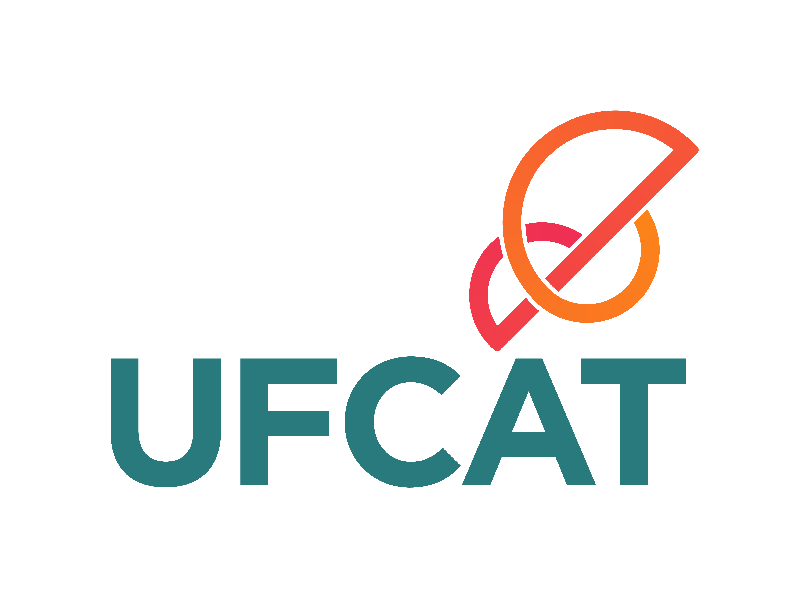

# Awesome UFCAT 

  

Uma lista colaborativa de materiais, provas e resumos para ajudar na sua jornada como aluno na **Universidade Federal de Catalão (UFCAT)**.

---

## Ocultar Dados Pessoais (Nova Ferramenta)
Vai enviar uma prova, mas não quer expor seu nome, assinatura ou matrícula? 
Nós criamos uma ferramenta oficial, gratuita e 100% segura (roda direto no seu navegador, sem enviar dados para a internet) para você riscar seus dados das provas antes de enviar!

👉 **[Acessar Editor de Provas Awesome UFCAT](https://gustavoborges13.github.io/awesome-ufcat/)**

---

## Disciplinas e Provas
Lista de provas das disciplinas ministradas na UFCAT. Cada pasta contém subdiretórios organizados por tipo de prova (Prova 1, Prova 2, Final, etc.) e os arquivos renomeados pelo semestre (Ex: `2023_1.pdf`).

## 📚 Lista de Disciplinas
<!-- INICIO_LISTA -->
- [Algebra Linear](Algebra%20Linear)
- [Algoritmos e Programacao de Computadores I](Algoritmos%20e%20Programacao%20de%20Computadores%20I)
- [Algoritmos e Programacao de Computadores II](Algoritmos%20e%20Programacao%20de%20Computadores%20II)
- [Analise e Projeto de Algoritmos](Analise%20e%20Projeto%20de%20Algoritmos)
- [Arquitetura de Computadores](Arquitetura%20de%20Computadores)
- [Banco de Dados I](Banco%20de%20Dados%20I)
    - [Prova 1](Banco%20de%20Dados%20I/Prova%201)
    - [Prova 2](Banco%20de%20Dados%20I/Prova%202)
    - [Prova 3](Banco%20de%20Dados%20I/Prova%203)
- [Banco de Dados II](Banco%20de%20Dados%20II)
- [Calculo I](Calculo%20I)
- [Calculo II](Calculo%20II)
- [Compiladores](Compiladores)
- [Computacao Grafica](Computacao%20Grafica)
- [Direito a Informatica](Direito%20a%20Informatica)
- [Empreendedorismo](Empreendedorismo)
- [Engenharia de Software I](Engenharia%20de%20Software%20I)
- [Engenharia de Software II](Engenharia%20de%20Software%20II)
- [Estrutura de Dados I](Estrutura%20de%20Dados%20I)
- [Estrutura de Dados II](Estrutura%20de%20Dados%20II)
- [Fabrica de Software](Fabrica%20de%20Software)
- [Fisica 3](Fisica%203)
- [Inteligencia Artificial](Inteligencia%20Artificial)
- [Interacao Humano Computador](Interacao%20Humano%20Computador)
- [Introducao a Computacao](Introducao%20a%20Computacao)
- [Laboratorio de Programacao I](Laboratorio%20de%20Programacao%20I)
- [Laboratorio de Programacao II](Laboratorio%20de%20Programacao%20II)
- [Laboratorio de Programacao III](Laboratorio%20de%20Programacao%20III)
- [Linguagens Formais e Automatos](Linguagens%20Formais%20e%20Automatos)
- [Linguagens de Programacao](Linguagens%20de%20Programacao)
- [Logica Matematica](Logica%20Matematica)
- [Matematica Discreta](Matematica%20Discreta)
- [Organizacao de Computadores](Organizacao%20de%20Computadores)
- [Pesquisa Operacional](Pesquisa%20Operacional)
- [Probabilidade e Estatistica](Probabilidade%20e%20Estatistica)
- [Processamento de Imagens](Processamento%20de%20Imagens)
- [Producao de Texto](Producao%20de%20Texto)
- [Programacao Orientada a Objetos](Programacao%20Orientada%20a%20Objetos)
- [Programação Funcional e Logica](Programa%C3%A7%C3%A3o%20Funcional%20e%20Logica)
- [Redes de Computadores I](Redes%20de%20Computadores%20I)
- [Redes de Computadores II](Redes%20de%20Computadores%20II)
- [Sistemas Digitais](Sistemas%20Digitais)
- [Sistemas Distribuidos](Sistemas%20Distribuidos)
- [Sistemas Operacionais I](Sistemas%20Operacionais%20I)
- [Sistemas Operacionais II](Sistemas%20Operacionais%20II)
- [Teoria da Computacao](Teoria%20da%20Computacao)
- [Teoria dos Grafos](Teoria%20dos%20Grafos)
<!-- FIM_LISTA -->

## Como Contribuir?

Veja o nosso [guia completo de como contribuir](CONTRIBUTING.md). É bem simples, não custa nada e você ganha três coisas com isso:

1. Isso conta como **contribuição em projetos open-source no GitHub**, o que é um diferencial gigantesco em currículos de tecnologia hoje em dia.
2. Você ajuda **todos os alunos do curso a se formarem mais rápido**.
3. Ajuda a acabar com um dos maiores problemas de nossa universidade: a temida e dispendiosa **retenção de alunos**.

### Nota aos Professores
Se você é um professor preocupado com os estudantes se preparando usando provas antigas (como eles deveriam estar fazendo), sinta-se livre para abrir uma *Issue* pedindo a remoção das suas provas deste repositório. A pasta contendo sua disciplina será removida o mais rápido possível.

---

## Templates

### Monografia
* [Template LaTeX](#) *(Inserir link futuramente)*

---

## Inspiração e Créditos
Este repositório foi fortemente inspirado e baseado no projeto [Awesome UFMA](https://github.com/elheremes/awesome-ufma). Todos os créditos pela ideia original, estrutura base e iniciativa vão para o [@elheremes](https://github.com/elheremes) e aos colaboradores da Universidade Federal do Maranhão. Obrigado por inspirarem outras universidades! ❤️
