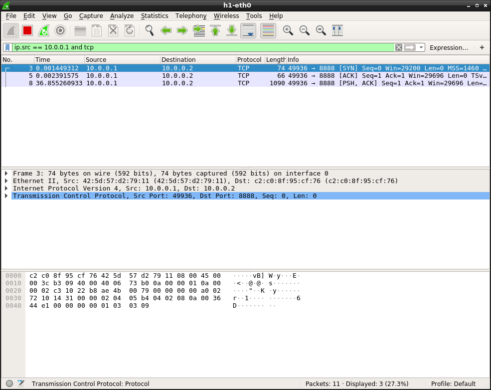
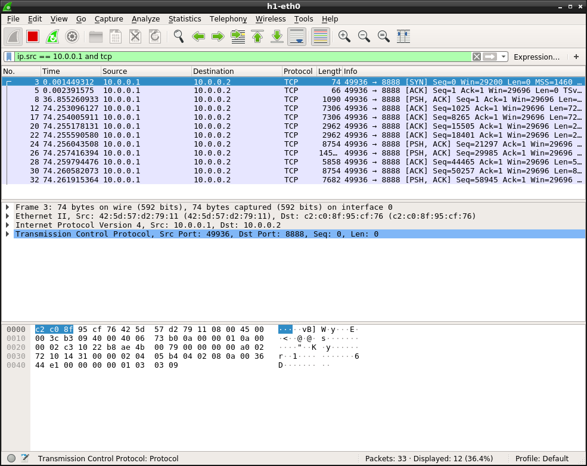
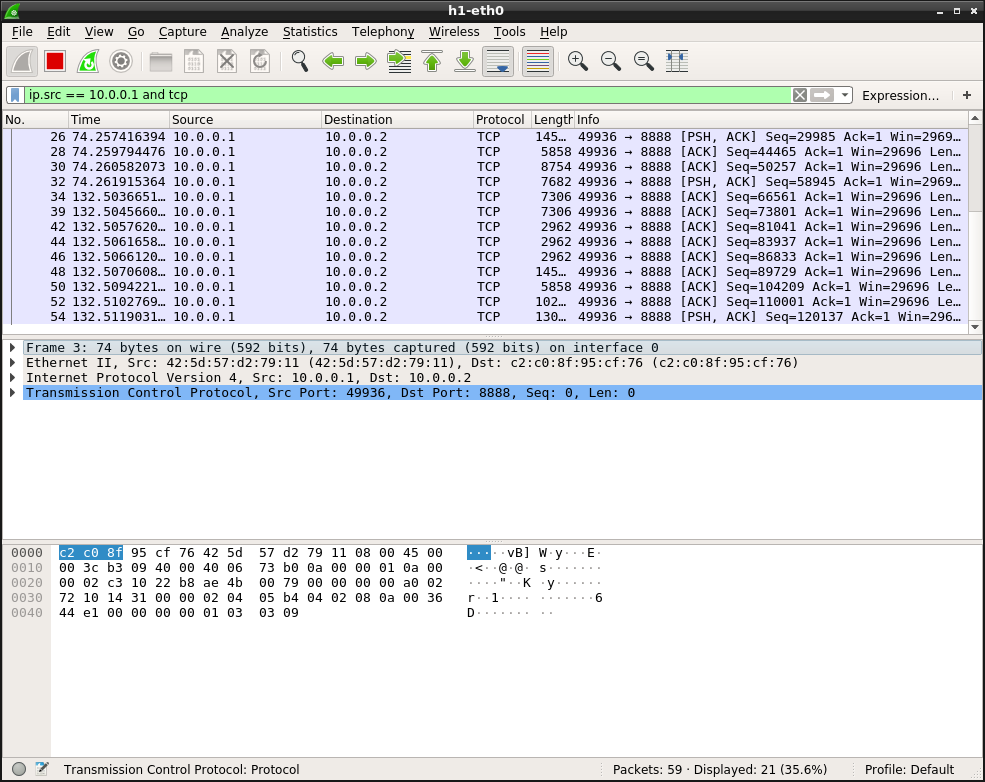
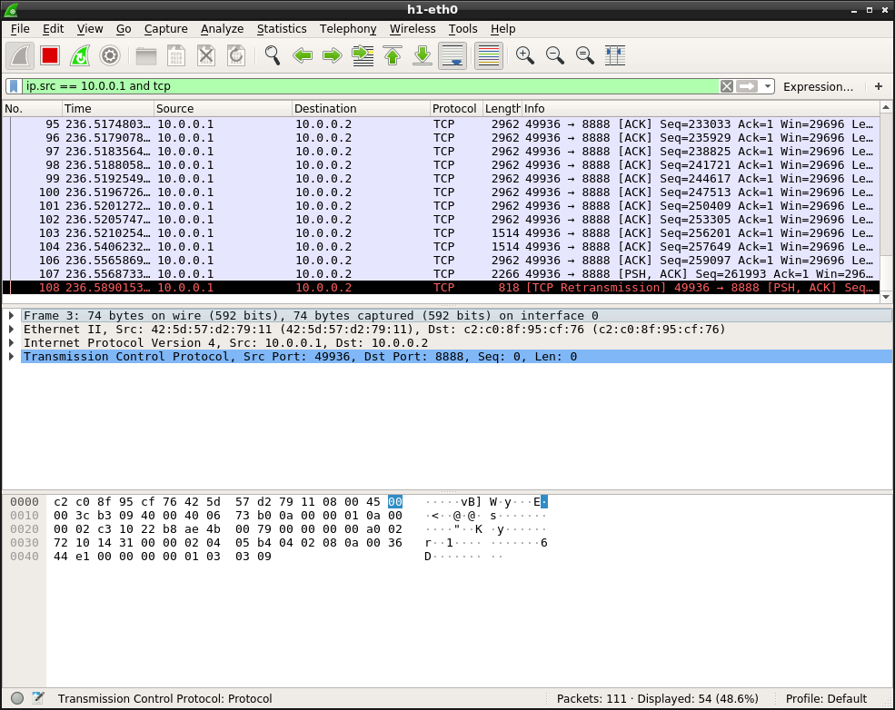
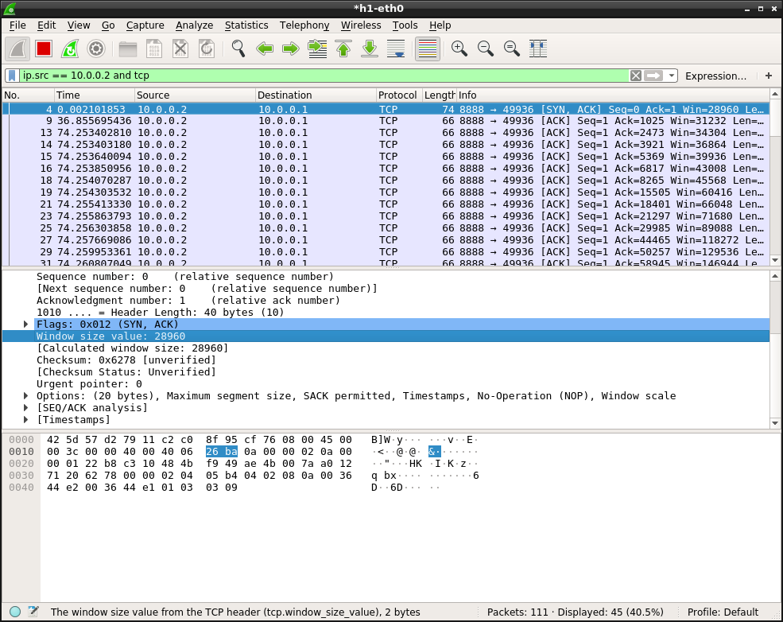
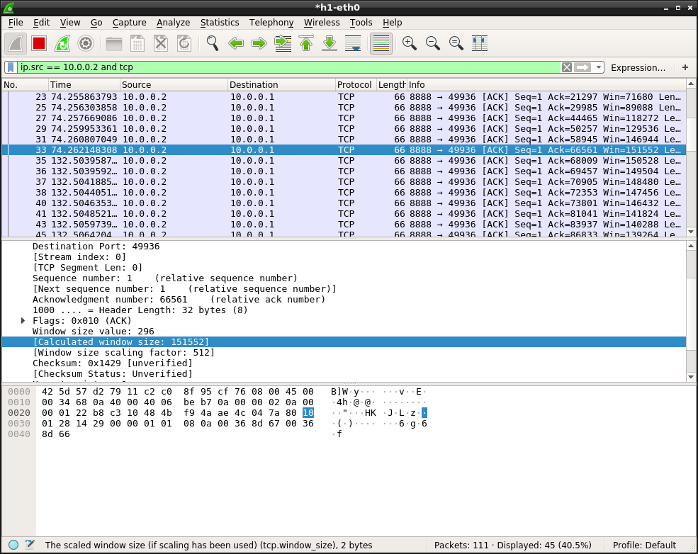
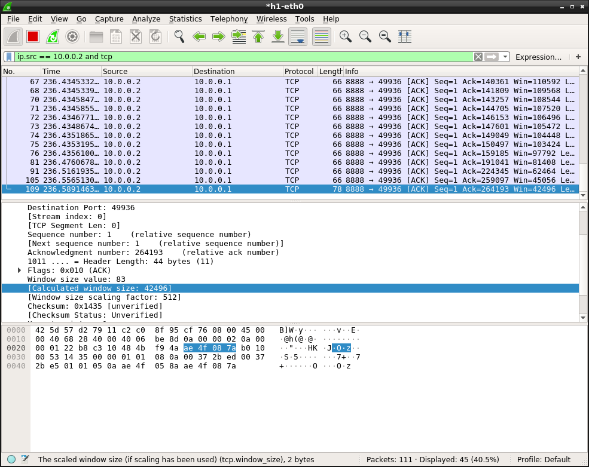
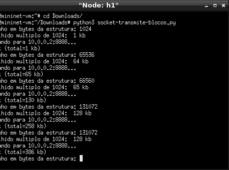
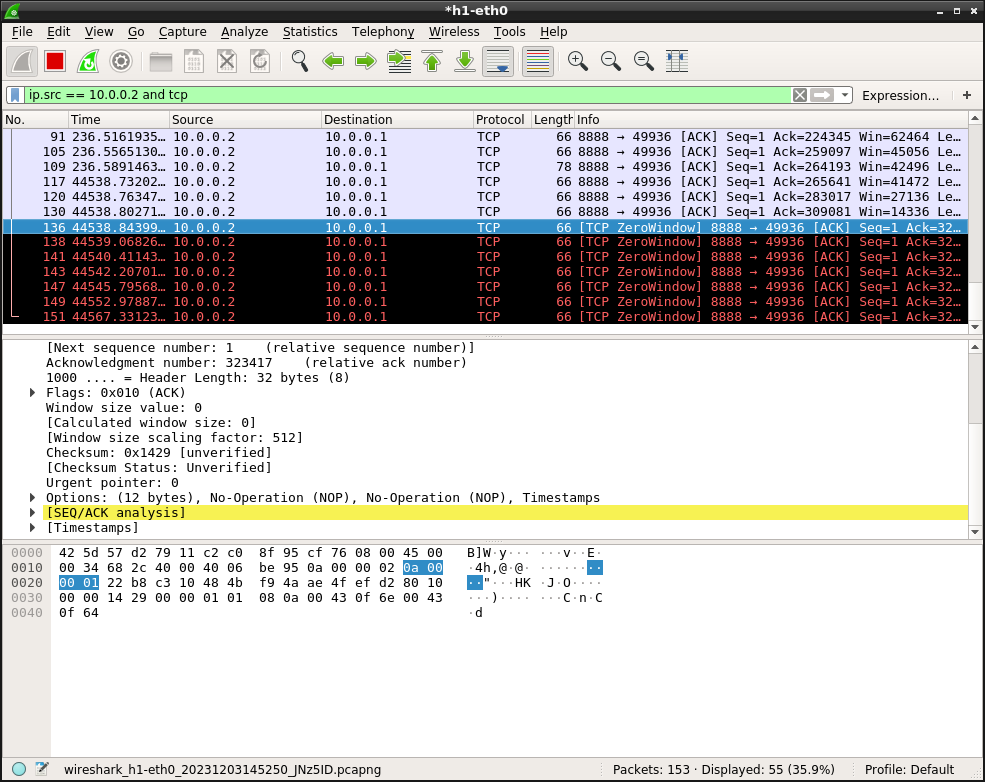

# Laboratório 2.2: Controle de Fluxo no TCP

## Identificação

* Aluno: "COLOQUE O SEU NOME AQUI"

## Formato das respostas

Exceto quando informando explicitamente, todos os resultados devem ser formatados usando a formatação de código no Markdown, conforme já feito nos laboratórios anteriores. Respostas em texto livre devem ser escritas em **texto normal**, sem formatação.

* Documentação do formato de tabelas no Markdown Github: <https://docs.github.com/en/github/writing-on-github/working-with-advanced-formatting/organizing-information-with-tables>

**Observe** que neste laboratório você deverá incluir arquivos externos com os dados coletados no experimento, além dos gráficos gerados. 

## Requisitos mínimos de entrega deste relatório

Conforme indicado no plano da disciplina, para obter nota mínima de 6,0 do relatório será necessário que ele atenda a **todos** os requisitos abaixo indicados:

1. Todas as tarefas na seção "Resultados" devem ser respondidas e devem seguir o formato solicitado.
2. Não deve haver qualquer tipo de cópia deste relatório com o que outro aluno. Os experimentos e o relatório são individuais.
3. O seu relatório deverá ser submetido pelo Github Classroom.

A complementação da nota pela avaliação qualitativa do relatório, considerará as respostas das questões abertas (em texto livre) e **sobretudo** os resultado do experimento.

Na seção [**"Feedback"**](#Feedback) ao fim deste relatório, o professor incluirá a avaliação do seu relatório.

## Resultados

O seu experimento deve ser executado para responder às questões abaixo, que estão reproduzidas no modelo do relatório do laboratório (Github Classroom). Quando necessário, as respostas devem ser justificadas pelo conteúdo do(s) pacote(s) TCP analisados pelo TShark/Wireshark que permitiram a conclusão.

1. Contexto do experimento

Descreva o cenário de experimentação utilizado (estações, largura de banda e atraso). Indique o resultado teórico e o experimental, obtido por medições. Você deverá utilizar uma largura de banda de até 54 Mbps e um atraso mínimo de 20ms. (texto livre)

Indique os comandos mininet utilizados para configurar o cenário.

        sudo mn --link tc,bw=54,delay=20
        xterm h1 h1 h2
        #Em h2:
        python3 socket-le-parcial.py
        #Em h1:
        wireshark
        python3 socket-transmite-blocos.py
        

2. Quantos pacotes TCP foram enviados para transmitir 1024 bytes e 64kbytes, 65kbytes e 128Kbytes? (dica: veja contagem de pacotes). (texto livre)
   
- 1024 bytes: 1
- 64kbytes: 9
- 65kbytes: 9
- 128Kbytes: 33

3. Explique como o valor foi obtido e inclua telas do Wireshark/TShark de onde obteve as informações. Todas as telas devem estar no diretório `telas-wireshark-tshark`, conforme "exemplo 1" abaixo. Caso prefira colocar o resultado textual dos dados coletados, descreva parte da saída que são relevantes para a sua explicação e coloque um link para os dados completos (também mantido no diretório `telas-wireshark-tshark`), conforme "exemplo 2". Inclua ou remova novas imagens ou links conforme necessário para sua resposta.

Ao abrir o wireshark foi estabelecido o filtro "ip.src == 10.0.0.1 and tcp" para mostrar apenas os pacotes tcp enviados pelo 10.0.0.1 ao servidor. Depois utilizando a informação no canto inferior direito "Packets - Displayed", foi possivel anotar o número de pacotes que cada transmissão gerava, subitraindo do valor anterior lá estabelecido ao final de cada transmissão.

-1024 bytes:

-64 kbytes:

-65 kbytes:

-128 kbytes:

4. Qual o tamanho da janela (na estação-alvo H2 da figura) no início da conexão? Explique como o valor foi obtido e inclua telas do Wireshark/TShark de onde obteve as informações, tal como já feito no item anterior.

O tamanho da janela de H2 no início da conexão é de 28960. Esse valor foi obtido através da seção TCP no wireshark ,do primeiro pacote enviado por 10.0.0.2 para 10.0.0.1, na seção "Calculated Window Size", assim como na imagem a seguir.

5. A janela de recepção nessa estação aumentou à medida em que bytes eram transmitidos? Se sim, qual foi o valor máximo que ela atingiu? Explique como o valor foi obtido e inclua telas do Wireshark/TShark de onde obteve as informações, tal como já feito no item anterior.

Conforme a transmissão de dados prosseguia, a janela de recepção em H2 aumentava à medida que mais bytes eram enviados. Esse aumento é uma demonstração do controle de fluxo dinâmico do TCP, permitindo que o remetente ajuste a taxa de transmissão com base na capacidade do destinatário de processar os dados. Onde o ponto mais alto alcançado pela janela de recepção foi de 151552.

No entanto, é perceptivel que, em determinado momento após esse pico, a janela de recepção começa a diminuiuir até 42496. Esse decréscimo indica que o buffer em H2 estava se aproximando de sua capacidade máxima, e o destinatário estava limitando a quantidade de dados que estava disposto a receber. Esse comportamento está alinhado com o controle de fluxo do TCP, evitando congestionamentos e garantindo uma comunicação eficiente entre os hosts.

6. Quantos bytes foram enviados para que a janela ficasse cheia na estação-alvo? Explique como o valor foi obtido e inclua telas do Wireshark/TShark de onde obteve as informações, tal como já feito no item anterior.

Foram enviados 386 bytes. 

7. Quando a janela ficou cheia, o que ocorria no processo transmissor ao tentar transmitir mais bytes? (texto livre)

Quando a janela de recepção estava completamente preenchida, resultando em uma condição conhecida como "janela cheia" ou "window full", o processo transmissor enfrentava uma limitação significativa. Nesse cenário, o TCP tentava reenviar alguns pacotes antes de efetivamente zerar a janela e interromper temporariamente a transmissão

8. Quanto a janela está cheia e o processo na estação-alvo lê o buffer, o que acontece em termos de trocas de mensagens TCP entre os dois? 

Nesse cenário, o processo transmissor continua enviando pacotes para a estação-alvo, mas os pacotes adicionais não são confirmados imediatamente devido à janela de recepção cheia. O transmissor aguarda as confirmações (ACK) dos pacotes anteriores antes de continuar a transmissão. Como a estação-alvo não estiver lendo o conteúdo do buffer, a janela de recepção permanece cheia, e o processo transmissor pode eventualmente entrar em um estado de espera até que a janela seja liberada.  Isso pode resultar em uma redução na eficiência da transmissão, já que o transmissor fica impedido de enviar novos dados até receber confirmações. O TCP conta com mecanismos para enfrentar cenários nos quais os ACKs não são recebidos, incorporando a retransmissão de pacotes. Entretanto, a inatividade da estação-alvo na leitura do conteúdo do buffer pode impactar adversamente o desempenho e a eficiência geral da comunicação TCP.

9. Para o item anterior, explique como o valor foi obtido e inclua telas do Wireshark/TShark de onde obteve as informações, tal como já feito no item anterior.

O i tem anterior foi obtido através do wireshark, ao notar que a janela de transmissão é 0 e ao notar que as mensagens tcp estão marcadas como "retransmissão". Como na imagem:

## Feedback do Professor

*Esta seção será escrita pelo professor ao final da avaliação do seu relatório*.

