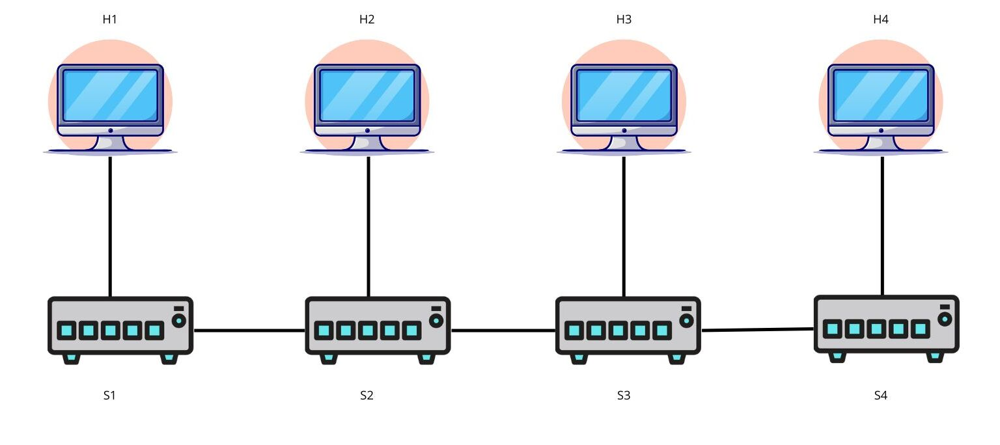
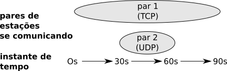
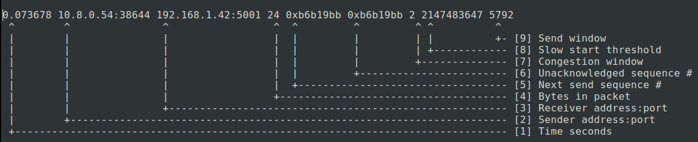
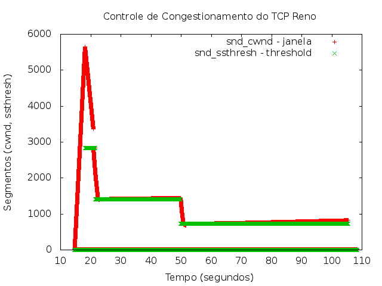

Laboratório 2.3: Controle de Congestionamento no TCP
====================================================

## Identificação

* Aluno: "COLOQUE O SEU NOME AQUI"

Na seção [**"Feedback"**](#Feedback) ao fim deste relatório, o professor incluirá a avaliação do seu relatório.

# Objetivos

+ Entender as causas e feitos de um congestionamento para o TCP
+ Entender o efeito do controle de congestionamento no TCP
+ Aprofundar o uso do mininet, wireshark e a configuração de um ambiente com uso de programas em python

# Visão Geral

Neste laboratório iremos verificar o funcionamento do controle de congestionamento do TCP usando um ambiente emulado mininet. Este laboratório é baseado em [um laboratório](http://computing.unn.ac.uk/staff/CGDK2/Teaching/EN746/lab10.html) da Northumbria University (link quebrado).

## Formato das respostas

Exceto quando informando explicitamente, todos os resultados devem ser formatados usando a formatação de código no Markdown, conforme já feito nos laboratórios anteriores. Respostas em texto livre devem ser escritas em **texto normal**, sem formatação.

* Documentação do formato de tabelas no Markdown Github: <https://docs.github.com/en/github/writing-on-github/working-with-advanced-formatting/organizing-information-with-tables>

**Observe** que neste laboratório você deverá incluir arquivos externos com os dados coletados no experimento, além dos gráficos gerados. 

## Requisitos mínimos de entrega deste relatório

Conforme indicado no plano da disciplina, para obter nota mínima de 6,0 do relatório será necessário que ele atenda a **todos** os requisitos abaixo indicados:

1. Todas as tarefas na seção "Resultados" devem ser respondidas e devem seguir o formato solicitado. Nenhuma resposta genérica, que não leve em conta os experimentos realizados e os resultados produzidos, não serão aceitos.
2. Não deve haver qualquer tipo de cópia deste relatório com o que outro aluno. Os experimentos e o relatório são individuais.
3. O seu relatório deverá ser submetido pelo Github Classroom.

A complementação da nota pela avaliação qualitativa do relatório, considerará as respostas das questões abertas (em texto livre) e **sobretudo** os resultado do experimento.

## Recursos

+ Slides: [Controle de Congestionamento no TCP](pdf/controle-congestionamento-tcp.pdf)
+ Máquina Virtual com `mininet`

### Opções do iperf/mininet úteis para o experimento

* iperf
   * `-c`: executa o iperf como cliente
   * `-s`: executa o iperf como servidor
   * `-t 60`: estende as medições do iperf por 60 segundos.
   * `-b 10M`: indica ao iperf que os pacotes devem ser transmitidos à vazão de 10Mbps (`1K` é 1 Kbps e o default é 1Mpbs) - **apenas para teste UDP**, que será necessário neste laboratório. Tanto o servidor como o cliente precisam ainda utilizar o parâmetro `-u`, para indicar que o teste será feito em UDP.
      * Em testes UDP, a velocidade de comunicação é determinada pelo cliente e o resultado do teste indica o número de pacotes perdidos. (por que no TCP isso não aparece?)
* Mininet (configuração de topologia)
   * `sudo mn --topo linear,4 --link tc,bw=20,delay=2ms`: cria uma topologia de 4 estações, com enlaces de 20Mbps e atraso de 2ms.

# Descrição

## Parte 1: Efeito do Congestionamento no TCP

Configure o mininet para criar uma configuração linear, com quatro estações, atrasos nos enlaces de 2ms e largura de banda de 20Mbps em cada enlace. Certifique-se de que todas as estações conseguem conversar entre si.

1. Faça um diagrama mostrando a configuração do cenário, mostrando switches e estações e como eles estão conectados. Não deixe para depois, pois o diagrama ajudará você a identificar como o restante do experimento deverá ser desenvolvido. (substitua a respectiva figura na área do Github)

2. Teste a largura de banda (TCP) entre as estações, usando o iperf. Se o experimento estiver corretamente configurado, ela deve ser de aproximadamente 20Mbps. Considerando as estações de H1 a H4, escolha dois pares de estações para se comunicar de maneira que haja **um enlace que seja compartilhado** entre os pares de estações durante uma comunicação. Veja com cuidado o diagrama que você descreveu anteriormente para escolher os pares corretamente. Se eles forem escolhidos erradamente, todo o restante do seu experimento falhará (e o seu laboratório estará errado). Descreva os pares escolhidos na tabela abaixo e a largura de banda obtida com o iperf, quando os pares foram testados **ISOLADAMENTE**.

| Par   | Estação | Estação | Largura da banda medida |
|-------|---------|---------|-------------------------|
| Par 1 |   h1    |    h3   |                20.80 Mbps |
| Par 2 |   h2    |    h4   |                22.75 Mbps |

3. Faça novamente o teste entre os pares de estação anteriores, mas executando iperf **SIMULTANEAMENTE** em cada um dos pares. Coloque o resultado abaixo. Por default, o `iperf` realiza o teste de desempenho por 10 segundo (veja a seção [configuracoes](#configuracoes)). O ideal é utilizar um tempo maior (30 segundos, por exemplo). **DICA**: a largura de banda deve ser bem diferente da anterior, do contrário haverá algum erro no cenário do seu experimento (reveja os itens anteriores). 

| Par   | Estação | Estação | Largura da banda SIMULTANEA |
|-------|---------|---------|-----------------------------|
| Par 1 |   h1    |    h3   |                    11.0 Mbps |
| Par 2 |   h2    |    h4   |                    8.6 Mbps |

4. Explique por que a largura de banda obtida no segundo experimento é diferente da anterior. (texto livre)

  A largura de banda obtida no segundo experimento é diferente da anterior devido à ocorrência de colisões. Quando os dois pares estão transmitindo simultaneamente, há uma competição pelo meio físico (o enlace compartilhado), resultando em colisões e retransmissões. O TCP é um protocolo orientado à conexão que realiza retransmissões quando ocorrem perdas de pacotes, e essa retransmissão, juntamente com o aumento da latência devido às colisões, leva a uma redução na largura de banda efetiva.

5. Refaça o experimento anterior (teste simultâneo), escolhendo um dos pares para transmitir pacotes UDP em três taxas de transmissão diferentes: 10Mbps, 20Mbps e 30Mbps. Colete as medições de largura de banda do TCP e pacotes perdidos no UDP em cada um dos casos e coloque o resultado na tabela de exemplo. O exemplo, considera que o par 1 realiza testes com TCP e o outro com UDP. **IMPORTANTE**: defina um tempo de experimento para 30s em cada um dos pares e inicie-os o mais simultaneamente possível. Os pacotes perdidos devem ser indicados em percentual e o iperf informa em número de pacotes perdidos e enviados.

| Teste | Par   | Tipo Teste | Estação | Estação | Largura de Banda | Pacotes Perdidos |
|-------|-------|------------|---------|---------|------------------|------------------|
|10 Mbps | Par 1 | TCP        |   h1    |    h3   |          11.3 Mbps |            ----- |
|10 Mbps | Par 2 | UDP        |   h2    |    h4   |             ---- |              0.71% |
|20 Mbps| Par 1 | TCP        |   h1    |    h3   |         2.38 Mbps |            ----- |
|20 Mbps| Par 2 | UDP        |   h2    |    h4   |             ---- |             2% |
|30 Mbps| Par 1 | TCP        |   h1    |    h3   |         0.9 Mbps |            ----- |
|30 Mbps| Par 2 | UDP        |   h2    |    h4   |             ---- |             35% |

6. Explique o resultado obtido em relação ao experimento anterior indicando: (1) o efeito no número de pacotes perdidos, (2) o efeito na largura de banda e (3) esse resultado em relação ao anterior. **Explicar não é meramente** repetir o resultado, mas explicar por que o fenômeno ocorreu, baseando-se no funcionamento do protocolo (TCP e UDP). (texto livre)

(1) No teste simultâneo, a transmissão UDP gera um aumento significativo no número de pacotes perdidos, pois o UDP não implementa mecanismos de retransmissão como o TCP. O efeito no número de pacotes perdidos é mais pronunciado à medida que a taxa de transmissão UDP aumenta. Isso ocorre porque, à medida que a taxa de transmissão aumenta, há uma maior probabilidade de que pacotes se sobreponham ou colidam, resultando em perda de pacotes.

(2) A largura de banda efetiva do TCP é mais afetada pela transmissão simultânea com o UDP, especialmente quando a taxa de transmissão UDP é alta. O TCP é sensível à concorrência na rede e reduz sua taxa de transmissão em resposta à detecção de congestionamento.

(3)  Comparado ao experimento anterior, o número de pacotes perdidos aumenta significativamente devido à competição pelo meio físico. A largura de banda do TCP também é mais prejudicada, pois ele reduz sua taxa de transmissão em resposta às condições adversas na rede. Essa competição e as retransmissões do TCP resultam em uma menor largura de banda efetiva durante o teste simultâneo.

## Parte 2: Funcionamento do Controle de Congestionamento no TCP

Nesta segunda parte do experimento, você irá verificar o funcionamento da janela de controle de congestionamento no cenário descrito anteriormente. 

O controle de congestionamento ocorre independentemente em cada nó comunicante. A sua atuação define a escolha do valor da janela de congestionamento corrente e que será avaliada para efeito do controle de erros. A janela que efetivamente será utilizada será o menor valor entre a janela de controle de fluxo e de controle de congestionamento.

A janela é uma variável mantida pelo algoritmo do TCP e não é trocada em mensagens do TCP. Por isso, não adianta inspecionar os pacotes TCP a procura do valor da janela. Para realizar um experimento em que acompanhamos o valor da janela, precisamos ter acesso ao kernel do sistema operacional, o qual faremos utilizando um módulo dinâmico do kernel do Linux chamado `tcp_probe` cujo objetivo é acompanhar o funcionamento do TCP no sistema operacional.

### Algoritmo de Controle de Congestionamento do TCP

Softwares utilizados neste experimento

   * Módulo `tcp_probe` do Kernel do Linux - estará presente na VM com mininet
      * Permite coletar os valores de parâmetros do TCP - particularmente, janela de congestionamento - durante um experimento.
      * Documentação:
         * <https://wiki.linuxfoundation.org/networking/tcpprobe>
         * <https://wiki.linuxfoundation.org/networking/tcp_testing> (descrição dos dados coletados)
   * **gnuplot**: programa de geração de gráficos
      * Utilizaremos para gerar os gráficos de controle de congestionamento a partir dos resultados gerados pelo `tcp_probe`.

Para realizar este experimento, siga os seguintes passos:

1. Verifique o algoritmo de controle de congestionamento usado pelo Linux, que é configurado na propriedade `net.ipv4.tcp_congestion_control` do Linux. Utilize o comando `sysctl` para verificar o valor dessa variável. O algoritmo utilizado por default é **cubic**.

        sysctl net.ipv4.tcp_congestion_control

2. Configure o TCP para uso do algoritmo de congestionamento **Reno** (comando abaixo)

        sudo sysctl -w net.ipv4.tcp_congestion_control=reno

3. Utilize o cenário de testes anterior, com os mesmo pares de estações. A conversa no **par 2** deve ser via UDP com largura de banda 5Mbps. No experimento, testaremos o funcionamento do controle de congestionamento em uma das estações do **par 1** (chamaremos de **hTeste**), reproduzindo o cenário da figura abaixo, onde o **par 1** deve se comunicar por TCP durante 90 segundos, usando o `iperf`, e no instante 30 segundo, o **par 2** deve iniciar uma comunicação a 5 Mbps, durante 30 segundos. O objetivo final é perceber como o controle de congestionamento trabalha durante todo esse intervalo de tempo.

4. Qual foi a estação (de H1 a H4) escolhida para ser **hTeste**)? Lembre-se: esta estação deve ser uma das que está se comunicando com TCP.

H1

5. No terminal da estação **hTeste** escolhida anteriormente, e **antes da execução do iperf**, carregue o módulo `tcp_probe` no Linux, indicando para registrar as informações referentes à conexão na porta 5001 (usada pelo iperf) com o seguinte comando:

        sudo modprobe tcp_probe port=5001 full=1

6. **Realize esses passos com atenção!** Abra um novo terminal na estação hospedeira do mininet (mas fora do sistema mininet) e inicie a coleta dos dados de controle de congestionamento, copiando os dados gerados em `/proc/net/tcpprobe` (pelo módulo do kernel) no arquivo `tcpprobe.out`, com o comando abaixo. **Importante**: esse comando ficará executando durante todo o experimento e você deverá finalizá-lo (Ctrl-C) assim que o experimento terminar. Observe que no comando abaixo, os resultados do mobprobe serão armazenados no arquivo que está no diretório `/home/mininet`. Você pode optar por guardar em qualquer diretório, mas prefira a área do mininet.

        sudo cat /proc/net/tcpprobe > /home/mininet/tcpprobe.out

7. Execute o experimento no mininet, conforme especificado em **(3)**.
8. Finalize o comando do passo **(5)**. Se tudo estiver correto, o arquivo `/home/mininet/tcpprobe.out` deverá ter alguns Mbytes. Confira se tudo funcionou antes de continuar. 
   * O arquivo `tcpprobe.out` deverá ter uma saída que deve ser interpretada da seguinte maneira ([fonte](https://wiki.linuxfoundation.org/networking/tcp_testing))
   
   

9. Gere os gráficos do controle de congestionamento executando o seguinte script gnuplot (observe que o script nas linhas 5 e 6 espera que a fonte dos dados estejam no arquivo `tcpprobe.out`). Estou considerando que o diretório atual é o diretório `/home/mininet`, onde foi armazenado o arquivo `tcpprobe.out` pelos comandos anteriores. Este script está no arquivo [grafico-congestionamento.gnuplot](codigo/gera-grafico-congestionamento.txt)

        set title "Controle de Congestionamento do TCP Reno"
        set style line 1
        show timestamp
        set xlabel "Tempo (segundos)"
        set ylabel "Segmentos (cwnd, ssthresh)"
        set terminal png
            set output 'resultados/grafico-controle-de-congestionamento.png'
        plot "tcpprobe.out" using 1:7 title "snd_cwnd - janela", \
            "tcpprobe.out" using 1:($8>=2147483647 ? 0 : $8) title "snd_ssthresh - threshold"

10. Ao final do experimento, remova o módulo `tcp_probe` com o seguinte comando:

                sudo modprobe -r tcp_probe

### Resultados e Análise do Funcionamento do Controle de Congestionamento

1. Gráfico resultado do experimento de controle de congestionamento. Você deve atualizar a figura com o gráfico produzido. Para gerar o gráfico, você deverá executar o comando (a partir do diretório onde está este arquivo).

        gnuplot codigo/gera-grafico-congestionamento.txt

O gráfico gerado deverá estar exposto abaixo. Substitua a figura, caso o comando anterior não tenha feito.
            

2. Copie as primeiras 200 linhas do arquivo `tcpprobe.out` no arquivo `resultados/dados-experimento.out` (como o arquivo é grande, estou pedindo apenas uma pequena parte dele. As 200 linhas são apenas uma aproximação. Você poderá gerar o arquivo com as primeiras linhas usando o comando Linux

        head -n 200 tcpprobe.out > dados-experimento.out
        
3. Discuta o funcionamento do controle de congestionamento no cenário, desde o inicio (0 segundos) até o final, mostrando como o algoritmo se comporta quando não há limitação de banda, quando ocorre um congestionamento e o que ocorre quando o congestionamento termina. Você deverá demonstrar na sua explicação que você de fato sabe como funciona o controle de congestionamento e sabe aplicá-lo ao cenário. Qualquer explicação genérica não será aceita.

- Início (0 segundos):
No incio o cenário, em que não há limitação de banda e à apenas a transmissão TCP ocorrendo. O emissor começa enviando dados para o destinatário a uma taxa máxima possível. Nesse estágio inicial, a janela de congestionamento (cwnd) aumenta exponencialmente, impulsionando a eficiência do envio.

- Sem Limitação de Banda(0 - 30 segundos):
Na ausência de restrições de banda, o emissor continua a expandir a taxa de envio exponencialmente, tirando proveito total da largura de banda disponível. A janela de congestionamento (cwnd) cresce rapidamente, otimizando a transmissão de dados.

- Ocorre um Congestionamento(30-60):
Com o início das transmissões UDP, inicia-se a ocorrenca de congestionamentos, sinais de estresse começam a surgir. Perdas de pacotes ou atrasos tornam-se evidentes, alertando para a necessidade de um ajuste.

- Controle de Congestionamento - Fase de Redução(30-60):
Diante dessas ocorrencias, o controle de congestionamento demonstra seuu funcionamento. O emissor reduz sua taxa de envio, implementando estratégias como a diminuição da janela de congestionamento (cwnd) ou a aplicação de algoritmos específicos (que não é o nosso caso),diminuindo a janela de congestionamento.

- Retransmissão de Pacotes Perdidos(40 - 60):
Além da redução na taxa de envio, o emissor inicia a retransmissão de pacotes perdidos para garantir a entrega correta dos dados. Esse processo visa corrigir as falhas que podem ter ocorrido durante o congestionamento.

- Recuperação Gradual(60-70):
Após a redução inicial, o emissor inicia uma fase de recuperação gradual. A taxa de envio é aumentada exponencialmente, mas de maneira cautelosa, ajustando-se dinamicamente às condições da rede para evitar a reincidência do congestionamento.

- Fim do Congestionamento:
No final do experimento sem a transmissão UDP na parte final, a rede retorna a um estado menos congestionado, indicado pelo recebimento de ACKs (confirmações), o emissor gradualmente intensifica sua taxa de envio. O controle de congestionamento opera de forma adaptativa, ajustando a transmissão para evitar futuros congestionamentos, otimizando assim a utilização da largura de banda disponível.

## Referências adicionais

* Exemplo e saída do `tcpprobe`: <https://witestlab.poly.edu/blog/tcp-congestion-control-basics/>
* Algoritmos de controle de congestionamento: <https://en.wikipedia.org/wiki/TCP_congestion_control#Algorithms>

## Feedback do Professor

*Esta seção será escrita pelo professor ao final da avaliação do seu relatório*.
