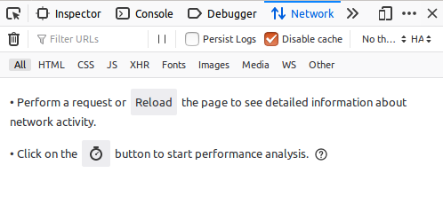

# Laboratório 3.1: Streaming de Multimidia e Efeito de Atrasos e Erros

## Identificação

* Aluno: "COLOQUE O SEU NOME AQUI"

## Objetivos

+ Identificar o efeito prático do aumento do **atraso**, **erros** no funcionamento de uma aplicação de streaming armazenada.
+ Identificar como aplicações de streaming utilizam adaptações de qualidade de transmissão durante uma transmissão.

## Formato das respostas

Exceto quando informando explicitamente, todos os resultados devem ser formatados usando a formatação de código no Markdown, conforme já feito nos laboratórios anteriores. Respostas em texto livre devem ser escritas em **texto normal**, sem formatação.

* Documentação do formato de tabelas no Markdown Github: <https://docs.github.com/en/github/writing-on-github/working-with-advanced-formatting/organizing-information-with-tables>

**Observe** que neste laboratório você deverá incluir arquivos externos com os dados coletados no experimento, além dos gráficos gerados. 

## Requisitos mínimos de entrega deste relatório

Conforme indicado no plano da disciplina, para obter nota mínima de 6,0 do relatório será necessário que ele atenda a **todos** os requisitos abaixo indicados:

1. Todas as tarefas na seção "Resultados" devem ser respondidas e devem seguir o formato solicitado.
2. Não deve haver qualquer tipo de cópia deste relatório com o que outro aluno. Os experimentos e o relatório são individuais.
3. O seu relatório deverá ser submetido pelo Github Classroom.

A complementação da nota pela avaliação qualitativa do relatório, considerará as respostas das questões abertas (em texto livre) e **sobretudo** os resultado do experimento.

Na seção [**"Feedback"**](#Feedback) ao fim deste relatório, o professor incluirá a avaliação do seu relatório.

## Recursos

Além do Mininet, você utilizará um protótipo de cliente (player) de video do DASH-HTTP, em Javascript, e que executa dentro de navegadores web, como Chrome e Firefox. 

+ Protótipo de Player DASH-HTTP para demonstração e depuração: <http://players.akamai.com/players/dashjs>
+ Exemplos de videos de diversas categorias e qualidade para testar no cliente <https://reference.dashif.org/dash.js/latest/samples/index.html>.

<a name="cuidados" />

## Cuidados Adicionais

Esta seção deve **necessariamente** ser lida antes de realizar o experimento e, dependendo do caso, o experimento terá que ser refeito para atender aos detalhes aqui mencionados. 

Ao realizar os experimentos: 

1. Desabilite o cache HTTP do seu browser para realizar o experimento. **Obrigatório**.

   Como o DASH-HTTP utiliza requisições HTTP para recuperar porções do video, ele acaba explorando o cache HTTP para melhorar o desempenho da reprodução do video: depois que um video é reproduzido pela primeira vez, a reprodução subsequente ocorre com parcelas do video mantidas localmente pelo browser (no cache). Neste caso, mudar os atrasos ou taxas de transmissão **não terá efeito** na reprodução do video. 

   Consequentemente, você terá que desabilitar o cache HTTP do browser utilizado durante o experimento.

   Para fazê-lo no Firefox (ou Chrome), escolha no menu **Ferramentas** / **Desenvolvedor Web** / **Rede** (ou simplesmente **Ctrl-Shift-E**) e selecione a caixa **"Desabilitar Cache"** (veja figura).



   Há outras maneiras de fazê-lo. **Não é suficiente recarregar a página** (usando F5, por exemplo).

2. 🚩 A versão da VM Linux onde usualmente o Mininet é distribuído, não vem com os codecs necessários para o navegavor web exibir o conteúdo multimidia da página DASH-HTTP utilizada no laboratório. Nessa situação, o navegador carregará a página do player DASH, tentará carregar o video, mas ele nunca aparecerá. Ao abrir o **Web Console** do browser, para visualizar os erros Javascript, aparecerá o problema. Para resolvê-lo, você pode instalar o VLC pois nas suas dependências estarão incluidos os pacotes com codes necessários. Instale o VLC utilizando o comando abaixo. Depois disso, o navegador passará a exibir o video (talvez seja necessário reiniciá-lo).

        sudo apt-get install vlc-nox
        
3. 🚩 O Firefox não permite que você o execute como root (que é o que ocorrerá em `h1`), sem uma configuração adicional. Para executar o Firefox utilize o comando abaixo dentro de uma estação como `h1`:

        sudo -u mininet firefox
   
<a id="mininet-config" />

## Configuração do Ambiente Mininet

Duas preocupações adicionais você precisará para configurar a execução do ambiente Mininet:

* **Acesso à Internet em estação virtualizada mininet**: 

   Você precisará tomar duas precauções para que uma estação com rede virtualizada acesse a Internet e você consiga realizar o seu experimento:

   1. Neste experimento você terá que acessar um recurso na Internet em um navegador web executando uma estação com rede virtualizada pelo mininet (`h1` ou `h2`, para ficar mais evidente). No mininet, por padrão, as estações **não acessam** a Internet e para fazê-lo você precisará habilitar o NAT no mininet, o que você faz invocando o mininet com a opção `--nat`. Se você realizar corretamente essa configuração, um ping para a estação `8.8.8.8` (ou outro IP Internet) deverá funcionar.
   
   2. 🚩 A maneira como a VM do Mininet está configurada, uma estação Mininet não conseguirá utilizar o DNS e portanto não conseguirá acessar sites na Internet. Para fazê-lo, precisaremos modificar a configuração do serviço de DNS usado pelo Linux da VM mininet. 
   
            sudo sh -c 'echo nameserver 8.8.8.8 > /etc/resolv.conf'
            
   Ao executar esse comando, o arquivo `/etc/resolv.conf` deverá ficar com o conteúdo `nameserver 8.8.8.8`. Você confirma isso  com o seguinte comando:
   
        cat /etc/resolv.conf
    
   Entre então na estação `h1` do Mininet e execute o comando `nslookup www.ufg.br` que deverá aparecer o IP da estação `www.ufg.br`. Do contrário, reveja os passos anteriores. O IP `8.8.8.8` é um servidor de DNS público da Google. Esses passos estão ilustrados na figura abaixo. **IMPORTANTE**: ao reiniciar a VM, a configuração do DNS voltará à original, então você terá que repetir os passos acima.
   
   
   
* **Configuração de Jitter no Mininet**

   Para configurar um jitter em cenário virtualizado no mininet você precisará adicionar um novo parâmetro `jitter`, dado em `ms`, que corresponde à variação do atraso que também precisará ser indicado no parâmetro de configuração do cenário. Por exemplo, para simular largura de banda de 54Mbps, atraso de 50ms e jitter de 20ms, assim como habilitar o NAT mencionado no item anterior, você precisará executar o mininet da seguinte maneira:
   
        sudo mn --nat --link tc,bw=54,delay=50ms,jitter=20ms
        
## MTR

O MTR é uma ferramenta similar ao traceroute, mas com muito mais flexibilidade e poder na coleta dos dados de comunicação. Basicamente, você precisa indicar o endereço do destino como parâmetro e ele mostrará a rota estimada para o destino e diversas medições de atraso em cada roteador no caminho. Neste experimento, só nos interessará os dados coletados no destino. Utilizaremos o MTR para estimar o jitter, passando o parâmetro `-o` e os campos que queremos que sejam exibidos, como no seguinte exemplo (que você pode usar no experimento, alterando o endereço): 

        mtr -o NBAWJMXI 8.8.8.8 -n

A figura abaixo mostra o exemplo de saída do MTR para o comando indicado. No caso mecionado, solicitamos ao MTR para exibir na sequência as medições de **último**, **melhor**, **médio** e **pior** atrasos, seguido de **último**, **médio** e **pior** jitter, terminando com jitter **interchegada** de pacotes. Atrasos são sempre o RTT e em ms.


<a id="atualizacao-mtr" />

🚩 A versão do `mtr` disponível em algumas VMs do mininet causam alguns problemas na execução. Para você conseguir fazer os testes, baixe uma versão mais nova do `mtr`. Deixei uma versão para vocês instalarem usando os seguintes comandos:

        cd ~
        wget https://github.com/rcarocha-dcc-ufcat/labs-auxilio/raw/master/rc2/softwares/mtr-0.89.zip
        unzip mtr-0.89.zip

É importante não esquecer da primeira linha, pois ela copiará os arquivos para o diretório raiz do usuário mininet. Feito isso, quando for executar, faça o seguinte:

        ~/mtr -o NBAWJMXI 8.8.8.8 -n
        
Observe com atenção o uso do **`~/mtr`** (til-barra-mtr) e, sugiro, usar a opção `-n` no final. Você deverá executar como admin, mas isso não será problema dentro do mininet. Caso apareça o erros

        Failure to open IPv4 sockets: Operation not permitted
        Failure to open IPv6 sockets: Address family not supported by protocol
        /home/mininet/mtr: Failure to start mtr-packet: Invalid argument
        
Execute como admin

        sudo ~/mtr -o NBAWJMXI 8.8.8.8 -n


## Funcionamento de Players DASH

Experimente o uso do cliente de streaming de midia DASH-HTTP que utilizaremos neste laboratório.

1. No navegador, abra o protótipo de player DASH disponibilizado pela Akamai em: <http://players.akamai.com/players/dashjs> (**não** utilize o player `hls.js`). Deixei uma demonstração de uso desse player para o laboratório em <https://youtu.be/s0-_a0bD6cI>.
2. Escolha duas ou mais midias do seguinte tipo:

   + Um video sob demanda (VOD), que corresponde a **uma aplicação de multimidia armazenada**. Procure fazer testes também com o video em 4K (requer 4 Kbps de bitrate)
   + Um video ao vivo (LIVE), que corresponde a **uma aplicação de multimidia ao vivo**.

   
## Parte I: Definição do Cenário de Testes

Nesta primeira parte, você configurará o ambiente para a realização dos testes.

1. Meça os atrasos e jitter da sua estação para a a fonte dos videos. Não é necessário fazê-lo dentro do Mininet. **Importante**: a fonte dos videos não é o endereço do player, mas o endereço indicado no arquivo MPD que descreve a mídia. É importante que este teste seja feito imediatamente antes das demais tarefas do laboratório, pois o atraso pode variar ao longo do dia. Coloque os dados coletados em tabela, seguindo modelo da tabela abaixo. Faça testes durante, ao menos, 1 minuto, para coletar os atrasos (**D**) e jitter (**J**). Meça também a bitrate obtida para essa midia, carregando no player DASH e verificando o melhor valor de bitrate que você obtem em "Basic Statistics"

| N | Tipo de Midia | Midia | Estação | IP      | Bitrate | Dmin | Dmédio | Dmax | Jmédio | Jinter | 
|---|---------------|-------|---------|---------|---------|------|--------|------|--------|--------| 
| 1 | Ao vivo       | https://cph-msl.akamaized.net/dash/live/2003285/test/manifest.mpd   | cph-msl.akamaized.net | 2.18.248.57 | 7.18Mbps   | 15.2 ms | 32.3 ms   | 197.6 ms | 18.6 ms   | 207.0 ms   | 
| 2 | armazenada    | https://dash.akamaized.net/dash264/TestCases/1a/sony/SNE_DASH_SD_CASE1A_REVISED.mpd  | dash.akamaized.net | 2.19.10.152 | 1.61 Mpbs | 14.2 ms | 30.1 ms   | 199.4 ms | 23.7 ms   | 251.0 ms   |  | 


2. Determinar o jitter, atraso que serão utilizados no experimento. Escolha 10 valores de atraso, desde o valor mínimo do atraso obtido nas medições até 200 ms. Para cada um desses valores, escolha três valors de jitter: 0, 100% do atraso e 200% o valor do atraso. Coloque os valores escolhidos na tabela abaixo, conforme o modelo.

| Atraso (ms) | Jitter 1 (ms) | Jitter 2 (ms) | Jitter 3 (ms) |
|-------------|---------------|---------------|---------------|
| 14.2        | 0             | 14.2          | 28.4          |
| 30          | 0             | 30            | 60            |
| 45          | 0             | 45            | 90            |
| 60          | 0             | 60            | 120           |
| 75          | 0             | 75            | 150           |
| 90          | 0             | 90            | 180           |
| 105         | 0             | 105           | 210           |
| 120         | 0             | 120           | 240           |
| 135         | 0             | 135           | 270           |
| 150         | 0             | 150           | 300           |


3. Determine taxas de transmissão (BW) que você utilizará para fazer o experimento, que devem variar em 10%, 30%, 50%, 70%, 100%, 200% e 1000% (10x) o valor do bitrate conseguido na tabela do item I.1.

| N | Tipo de Mídia | 10%   | 30%   | 50%   | 70%   | 100%  | 200%  | 1000%  |
|---|---------------|-------|-------|-------|-------|-------|-------|--------|
| 1 | Ao Vivo         | 0.718 | 2.154 | 3.59  | 5.026 | 7.18  | 14.36 | 71.8   |
| 2 | Armazenada          | 0.161 | 0.483 | 0.805 | 1.127 | 1.61  | 3.22  | 16.1   |


## Parte II: Experimentação do Efeito do Atraso em Streaming

Nestes experimento você deverá desabilitar o cache do browser, conforme indicado na seção <a href="#cuidados">Cuidados</a>. Se você não fizer isso, coletará resultados errados e seu experimento será perdido.

Para cada uma das midias escolhidas anteriormente, siga os procedimentos abaixo. Todas as respostas deverão está dispostas na seção *"Resultados Coletados"*.

1. Baixe a descrição da midia pela URL com terminação MPD que aparece no topo da aplicação. 
2. Verifique a lista dos bitrates oferecidos em cada tipo de segmento. O arquivo MPD é um XML e os bitrates estão indicados na propriedade `bandwidth` da tag `Representation`. Informe o bitrates em Kbps ou Mbps.
3. Para cada um dos valores de atraso e jitter previstos anteriormente, configure um ambiente mininet para reproduzir o cenário desejado. Inicialmente, a largura de banda será ignorada. Meça os atrasos com `ping` dentro da estação para saber se o mininet está reproduzindo exatamente aquele atraso que deseja (faça os ajustes necessários).
   
   1. Execute o player em um navegador disparado de dentro do uma estação com rede virtualizada (`h1` ou `h2`, para ficar mais evidente).
   2. Observando as estatística do player, colete os valores de **Bitrate** (selecionado) e o **Tamanho do Buffer**. Esses valores irão variar bastante no inicio, por isso, espere um tempo até que eles fique razoavelmente estáveis. Caso não fiquem estáveis, indique os dois ou três valores de bitrate/atraso. 
   3. Coloque os valores coletados em uma tabela seguindo o modelo abaixo. Lembre-se que as duas primeiras colunas surgem das escolhas da parte I deste laboratório e as duas últimas serão coletadas.
      
4. Comente os resultados obtidos e eventuais instabilidades nos valores. Explique os resultados obtidos ou comente surpresas encontradas no comportamento.
5. Para cada um dos valores de largura de banda escolhidos anteriormente, e com atrasos/jitter em 0, refaça o experimento anterior, coletando o novamente o Bitrate e tamanho do buffer selecionados. 
6. Comente os resultados obtidos e eventuais instabilidades nos valores. Explique os resultados obtidos ou comente surpresas encontradas no comportamento.
   
### Resultados Coletados

**Midia 1: Streaming (Armazenada)**

1. Bitrates oferecidos para a mídia (texto livre)

- Representação 1 (id="1_1"): 1005568 bps
- Representação 2 (id="1_2"): 1609728 bps
- Representação 3 (id="1_3"): 704512 bps
- Representação 4 (id="1_4"): 452608 bps
   
2. Tabela com variações de bitrates e buffer em função do atraso e jitter.
  
| Atraso (ms) | Jitter (ms) | Bitrate (Mbps) | Buffer (s) |
|-------------|-------------|-----------------|------------|
| 14.2        | 0           | 1.61            | 30.56      |
| 30          | 0           | 1.61            | 30.2       |
| 45          | 0           | 1.61            | 30.04      |
| 60          | 0           | 1.61            | 27.01      |
| 75          | 0           | 1.01            | 12.86      |
| 90          | 0           | 1.01            | 9.76      |
| 105         | 0           | 1.01            | 8.45      |
| 120         | 0           | 0.7             | 8.35      |
| 135         | 0           | 0.45            | 7.87       |
| 150         | 0           | 0.45            | 7.11       |
| 14.2        | 14.2        | 1.61            | 13.87      |
| 30          | 30          | 1.61            | 12.62      |
| 45          | 45          | 1.01            | 11.96      |
| 60          | 60          | 1.01            | 10.57      |
| 75          | 75          | 1.01            | 9.94      |
| 90          | 90          | 0.7             | 8.78      |
| 105         | 105         | 0.7             | 7.92       |
| 120         | 120         | 0.7             | 7.28       |
| 135         | 135         | 0.45            | 6.44       |
| 150         | 150         | 0.45            | 5.66       |
| 14.2        | 28.4        | 1.61            | 13.04      |
| 30          | 60          | 1.61            | 12.83      |
| 45          | 90          | 0.7             | 12.25      |
| 60          | 120         | 0.7             | 11.39      |
| 75          | 150         | 0.7             | 10.99      |
| 90          | 180         | 0.7             | 6.09       |
| 105         | 210         | 0.7             | 5.77       |
| 120         | 240         | 0.45            | 4.94       |
| 135         | 270         | 0.45            | 3.44       |
| 150         | 300         | 0.45            | 2.84       |


      
3. Coloque os comandos mininet utilizados para configurar cada uma das situações anteriores.       
```
Jiter 0
sudo mn --nat --link tc,delay=14.2ms,jitter=0ms
sudo mn --nat --link tc,delay=30ms,jitter=0ms
sudo mn --nat --link tc,delay=45ms,jitter=0ms
sudo mn --nat --link tc,delay=60ms,jitter=0ms
sudo mn --nat --link tc,delay=75ms,jitter=0ms
sudo mn --nat --link tc,delay=90ms,jitter=0ms
sudo mn --nat --link tc,delay=105ms,jitter=0ms
sudo mn --nat --link tc,delay=120ms,jitter=0ms
sudo mn --nat --link tc,delay=135ms,jitter=0ms
sudo mn --nat --link tc,delay=150ms,jitter=0ms

Jiter 100%
sudo mn --nat --link tc,delay=14.2ms,jitter=14.2ms
sudo mn --nat --link tc,delay=30ms,jitter=30ms
sudo mn --nat --link tc,delay=45ms,jitter=45ms
sudo mn --nat --link tc,delay=60ms,jitter=60ms
sudo mn --nat --link tc,delay=75ms,jitter=75ms
sudo mn --nat --link tc,delay=90ms,jitter=90ms
sudo mn --nat --link tc,delay=105ms,jitter=105ms
sudo mn --nat --link tc,delay=120ms,jitter=120ms
sudo mn --nat --link tc,delay=135ms,jitter=135ms
sudo mn --nat --link tc,delay=150ms,jitter=150ms

Jitter 200%
sudo mn --nat --link tc,delay=14.2ms,jitter=28.4ms
sudo mn --nat --link tc,delay=30ms,jitter=60ms
sudo mn --nat --link tc,delay=45ms,jitter=90ms
sudo mn --nat --link tc,delay=60ms,jitter=120ms
sudo mn --nat --link tc,delay=75ms,jitter=150ms
sudo mn --nat --link tc,delay=90ms,jitter=180ms
sudo mn --nat --link tc,delay=105ms,jitter=210ms
sudo mn --nat --link tc,delay=120ms,jitter=240ms
sudo mn --nat --link tc,delay=135ms,jitter=270ms
sudo mn --nat --link tc,delay=150ms,jitter=300ms
```

4. Comente os resultados obtidos e eventuais instabilidades nos valores. Explique os resultados obtidos ou comente surpresas encontradas no comportamento. (texto livre)

Os resultados obtidos a partir da análise da tabela proporcionam uma visão detalhada das relações entre atraso, jitter, bitrate e buffer em um ambiente de transmissão de dados. Notavelmente, a influência do atraso é evidente na tendência geral de aumento do buffer à medida que o atraso aumenta. Essa observação é consistente com a intuição de que maior latência permite um acúmulo mais significativo de dados no buffer, contribuindo para uma experiência de transmissão mais suave.

A presença de jitter, no entanto, introduz uma dinâmica adicional. O aumento do jitter está associado a variações mais pronunciadas no tamanho do buffer, indicando que oscilações rápidas na chegada dos pacotes podem resultar em flutuações significativas no armazenamento temporário de dados. Além disso, a relação entre jitter e bitrate revela nuances interessantes, sugerindo que a estabilidade da rede pode ter implicações na taxa de transferência de dados.

É notável que o buffer, em situações de jitter, possa experimentar flutuações mais acentuadas. Isso destaca a importância da estabilidade da rede para garantir uma reprodução consistente. Resultados inesperados, como a diminuição do buffer com o aumento do atraso em certos contextos, apontam para complexidades nas interações entre as variáveis, indicando que as relações não são necessariamente lineares.

5. Tabela de bitrates e buffer em função da variação da largura de banda.

      | Largura de Banda (Mbps) | Bitrate (Mbps) | Buffer (s) |
      |-------------------------|----------------|------------|
      | 0.161                   | 0.45           | 0.03       |
      | 0.483                   | 0.45           | 0.84       |
      | 0.805                   | 0.45           | 9.42       |
      | 1.127                   | 0.7            | 12.45      |
      | 1.61                    | 1.01           | 14.79      |
      | 3.22                    | 1.61           | 15.61      |
      | 16.1                    | 1.61           | 31.99      |


6. Comente os resultados obtidos e eventuais instabilidades nos valores. Explique os resultados obtidos ou comente surpresas encontradas no comportamento. (texto livre)
   
Ao analisar os resultados apresentados na tabela que relaciona largura de banda, bitrate e buffer, algumas tendências e comportamentos emergem, fornecendo insights valiosos sobre o desempenho de sistemas de transmissão em diferentes cenários.

Primeiramente, é observado que o buffer tende a aumentar à medida que a largura de banda aumenta. Isso sugere que uma maior capacidade de transmissão está associada a buffers mais espaçosos, o que é compreensível, pois uma largura de banda mais alta permite o armazenamento de uma quantidade maior de dados temporários para garantir uma transmissão suave e contínua.

Um ponto interessante é a estabilidade do bitrate em determinadas condições, mesmo com o aumento da largura de banda. Isso indica que, em alguns casos, o sistema pode estar operando no limite de sua capacidade de transmissão, e incrementos adicionais na largura de banda não resultam em aumentos correspondentes na taxa de transferência de dados.

**Midia 2: Streaming (*indique o tipo*)**

1. Bitrates oferecidos para a mídia (Ao vivo)

 - Representação 1 (id="0"): 444105 Kbps
 - Representação 2 (id="2"): 1371959 Kbps
 - Representação 3 (id="4"): 2243822 Kbps
 - Representação 4 (id="6"): 4179506 Kbps
 -Representação 5 (id="8"): 7179013 Kbps

- Representação 6 (id="1"): 56052 Kbps
- Representação 7 (id="3"): 128100 Kbps
- Representação 8 (id="5"): 255759 Kbps
- Representação 9 (id="7"): 318658 Kbps
   
2. Tabela com variações de bitrates e buffer em função do atraso e jitter.
  
      | Atraso (ms) | Jitter (ms) | Bitrate (Mbps) | Buffer (s) |
      |-------------|-------------|-----------------|------------|
      | 14.2        | 0           | 4.18            | 14.95      |
      | 30          | 0           | 4.18            | 14.24      |
      | 45          | 0           | 4.18            | 14.0       |
      | 60          | 0           | 2.24            | 13.96      |
      | 75          | 0           | 2.24            | 13.82      |
      | 90          | 0           | 2.24            | 13.62      |
      | 105         | 0           | 1.37            | 12.77      |
      | 120         | 0           | 0.44            | 12.38      |
      | 135         | 0           | 0.44            | 11.81      |
      | 150         | 0           | 0.44            | 10.33      |
      | 14.2        | 14.2        | 1.37            | 15.52      |
      | 30          | 30          | 1.37            | 15.12      |
      | 45          | 45          | 1.37            | 14.34      |
      | 60          | 60          | 1.37            | 13.76      |
      | 75          | 75          | 1.37            | 11.66      |
      | 90          | 90          | 0.44            | 8.5        |
      | 105         | 105         | 0.44            | 5.95       |
      | 120         | 120         | 0.44            | 5.71       |
      | 135         | 135         | 0.44            | 5.32       |
      | 150         | 150         | 0.44            | 2.22       |
      | 14.2        | 28.4        | 1.37            | 15.07      |
      | 30          | 60          | 1.37            | 14.28      |
      | 45          | 90          | 0.44            | 13.31      |
      | 60          | 120         | 0.44            | 13.04      |
      | 75          | 150         | 0.44            | 7.14       |
      | 90          | 180         | 0.44            | 6.02       |
      | 105         | 210         | 0.44            | 5.17       |
      | 120         | 240         | 0.44            | 4.26       |
      | 135         | 270         | 0.44            | 0.52       |
      | 150         | 300         | 0.44            | 0.41       |

      
3. Coloque os comandos mininet utilizados para configurar cada uma das situações anteriores.       

```
Jiter 0
sudo mn --nat --link tc,delay=14.2ms,jitter=0ms
sudo mn --nat --link tc,delay=30ms,jitter=0ms
sudo mn --nat --link tc,delay=45ms,jitter=0ms
sudo mn --nat --link tc,delay=60ms,jitter=0ms
sudo mn --nat --link tc,delay=75ms,jitter=0ms
sudo mn --nat --link tc,delay=90ms,jitter=0ms
sudo mn --nat --link tc,delay=105ms,jitter=0ms
sudo mn --nat --link tc,delay=120ms,jitter=0ms
sudo mn --nat --link tc,delay=135ms,jitter=0ms
sudo mn --nat --link tc,delay=150ms,jitter=0ms

Jiter 100%
sudo mn --nat --link tc,delay=14.2ms,jitter=14.2ms
sudo mn --nat --link tc,delay=30ms,jitter=30ms
sudo mn --nat --link tc,delay=45ms,jitter=45ms
sudo mn --nat --link tc,delay=60ms,jitter=60ms
sudo mn --nat --link tc,delay=75ms,jitter=75ms
sudo mn --nat --link tc,delay=90ms,jitter=90ms
sudo mn --nat --link tc,delay=105ms,jitter=105ms
sudo mn --nat --link tc,delay=120ms,jitter=120ms
sudo mn --nat --link tc,delay=135ms,jitter=135ms
sudo mn --nat --link tc,delay=150ms,jitter=150ms

Jitter 200%
sudo mn --nat --link tc,delay=14.2ms,jitter=28.4ms
sudo mn --nat --link tc,delay=30ms,jitter=60ms
sudo mn --nat --link tc,delay=45ms,jitter=90ms
sudo mn --nat --link tc,delay=60ms,jitter=120ms
sudo mn --nat --link tc,delay=75ms,jitter=150ms
sudo mn --nat --link tc,delay=90ms,jitter=180ms
sudo mn --nat --link tc,delay=105ms,jitter=210ms
sudo mn --nat --link tc,delay=120ms,jitter=240ms
sudo mn --nat --link tc,delay=135ms,jitter=270ms
sudo mn --nat --link tc,delay=150ms,jitter=300ms
```

4. Comente os resultados obtidos e eventuais instabilidades nos valores. Explique os resultados obtidos ou comente surpresas encontradas no comportamento. (texto livre)

Primeiramente, é perceptível que o aumento do atraso tende a reduzir o bitrate. Isso é intuitivo, pois um atraso maior geralmente implica em uma menor taxa de transmissão de dados. Por exemplo, quando o atraso é de 14.2 ms, o bitrate é de 4.18 Mbps, enquanto para um atraso de 200 ms, o bitrate diminui para 0.44 Mbps.

Em relação ao buffer, observamos um comportamento inverso: à medida que o atraso aumenta, o buffer tende a aumentar também. Isso faz sentido, pois um atraso maior permite mais tempo para armazenar dados em buffer antes de serem reproduzidos. Por exemplo, o buffer vai de 14.95 segundos para um atraso de 14.2 ms para 0.41 segundos para um atraso de 150 ms.

Quando introduzimos jitter, notamos que o buffer tende a aumentar significativamente. Isso ocorre porque o jitter pode causar variações na chegada dos pacotes, exigindo um buffer maior para compensar essas variações e manter uma reprodução suave.

Em termos de estabilidade, observamos que valores extremos de jitter, especialmente quando combinados com atrasos mais curtos, podem resultar em flutuações significativas no buffer, potencialmente levando a interrupções na reprodução. Isso destaca a importância de garantir que os valores de atraso e jitter estejam dentro de limites aceitáveis para evitar problemas de estabilidade.

5. Tabela de bitrates e buffer em função da variação da largura de banda.

| Largura de Banda (Mbps) | Bitrate (Mbps) | Buffer (s) |
|-------------------------|----------------|------------|
| 0.718                   | 0.44           | 12.0      |
| 2.154                   | 1.37           | 13.95      |
| 3.59                    | 2.24           | 14.23       |
| 5.026                   | 2.24           | 14.61      |
| 7.18                    | 4.18           | 15.32       |
| 14.36                   | 7.18           | 16.01      |
| 71.8                    | 7.18           | 29.91       |

6. Comente os resultados obtidos e eventuais instabilidades nos valores. Explique os resultados obtidos ou comente surpresas encontradas no comportamento. (texto livre)

Primeiramente, é evidente que o bitrate tende a aumentar proporcionalmente à largura de banda. Isso é esperado, pois uma maior largura de banda permite a transferência de uma maior quantidade de dados em um determinado período de tempo.

Quanto ao tamanho do buffer, observa-se um aumento geral com o aumento da largura de banda. Um buffer maior é benéfico para lidar com variações na taxa de transmissão, proporcionando uma experiência de reprodução mais suave. Entretanto, é interessante notar que, em alguns casos, o aumento no buffer não é estritamente proporcional ao aumento na largura de banda.

A estabilidade do buffer é um ponto de atenção. Embora em muitos casos o buffer aumente conforme a largura de banda aumenta, variações não proporcionais podem indicar que outros fatores, como latência de rede ou características específicas do sistema, podem influenciar o desempenho.

Um aspecto interessante é a observação para larguras de banda extremamente altas. Nesses casos, o aumento no buffer pode não ser tão significativo, indicando que pode haver um ponto de saturação ou otimização, onde a largura de banda adicional não se traduz em benefícios substanciais para o buffer.

A relação entre bitrate e buffer também é relevante. Em alguns casos, o aumento no bitrate resulta em um aumento menos expressivo no buffer, sugerindo a existência de um trade-off entre esses dois parâmetros. Encontrar o equilíbrio adequado é crucial para otimizar a experiência de transmissão.
   
   
## Referências

+ Iraj Sodagar, ["The MPEG-DASH Standard for Multimedia Streaming Over the Internet,"](http://ieeexplore.ieee.org/xpls/icp.jsp?arnumber=6077864) IEEE Multimedia, vol. 18, no. 4, pp. 62-67, October-December, 2011 
+ Stoekhammer, T. ["Dynamic adaptive streaming over HTTP-design principles and standards."](https://www.w3.org/2010/11/web-and-tv/papers/webtv2_submission_64.pdf) Proceedings of the Second Annual ACM Conference on Multimedia Systems. Vol. 2014. New York, USA: ACM, 2011.
+ <https://en.wikipedia.org/wiki/Dynamic_Adaptive_Streaming_over_HTTP>
+ Ibrahim Ayad, Youngbin Im, Eric Keller, Sangtae Ha, [**A Practical Evaluation of Rate Adaptation Algorithms in HTTP-based Adaptive Streaming**](https://www.sciencedirect.com/science/article/pii/S1389128618300288), Computer Networks, Volume 133, 14 March 2018, Pages 90-103, ISSN 1389-1286, <https://doi.org/10.1016/j.comnet.2018.01.019>.

<p id="Feedback" />

## Feedback do Professor

*Esta seção será escrita pelo professor ao final da avaliação do seu relatório*.

