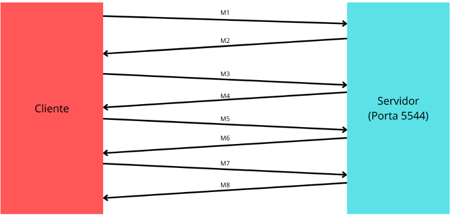

# Laboratório 3.2: Multimidia: Servidor de Streaming de Mídia e Protocolo RTP/RTSP

## Identificação

* Aluno: "COLOQUE O SEU NOME AQUI"

## Formato das respostas

Exceto quando informando explicitamente, todos os resultados devem ser formatados usando a formatação de código no Markdown, conforme já feito nos laboratórios anteriores. Respostas em texto livre devem ser escritas em **texto normal**, sem formatação.

* Documentação do formato de tabelas no Markdown Github: <https://docs.github.com/en/github/writing-on-github/working-with-advanced-formatting/organizing-information-with-tables>

Todo o código produzido deve ser colocado no diretório `python`. Dentro desse diretório, você poderá utilizar a organização que preferir.


## Requisitos mínimos de entrega deste relatório

Conforme indicado no plano da disciplina, para obter nota mínima de 6,0 do relatório será necessário que ele atenda a **todos** os requisitos abaixo indicados:

1. Todas as tarefas na seção "Resultados" devem ser respondidas e devem seguir o formato solicitado.
2. Não deve haver qualquer tipo de cópia deste relatório ou do código produzido com o de outro aluno, **independentemente do semestre**. Os experimentos e o relatório são individuais.
3. O seu relatório deverá ser submetido pelo Github Classroom.

A complementação da nota pela avaliação qualitativa do relatório, considerará as respostas das questões abertas (em texto livre) e **sobretudo** o código produzido.

A seção [**"Feedback"**](#Feedback) ao fim deste relatório conterá uma descrição da avaliação do professor.


## Objetivos

+ Compreender a iteração básica de um cliente com servidor de streaming, investigando o protocolo RTP/RTSP.

## Recursos

+ [VLC](https://www.videolan.org/vlc/index.html) - cliente e servidor de streaming. Você deverá instalar com o comando:

		sudo apt-get install vlc

+ Amostras de videos para testes. Exemplos:
   + <https://eoimages.gsfc.nasa.gov/images/imagerecords/57000/57760/rotate_640.mpg>
   + <https://mars.nasa.gov/mer/gallery/video/movies/spirit/mer20110719_SpiritMontage-640.m4v>
   + <https://home.in.tum.de/~paula/mpeg/lion.mpg>


## Referências

+ Streaming video sob demanda com VLC: <https://wiki.videolan.org/Documentation:Streaming_HowTo/VLM/>
+ <https://developer.mozilla.org/en-US/Apps/Fundamentals/Audio_and_video_delivery/Live_streaming_web_audio_and_video>
+ webRTC
   + <https://webrtc.org/native-code/logging/>
   + <http://stackoverflow.com/questions/17530197/how-to-do-network-tracking-or-debugging-webrtc-peer-to-peer-connection>


## Atividades 

### Parte I: Configuração e Execução do Servidor de Streaming sob demanda

1. Inicie o `vlc` no modo de servidor de streaming de midia, utilizando o seguinte comando (ou uma variação dele):

		vlc --ttl 12 -vvv --color -I telnet --telnet-password senhadoservidor --rtsp-host 0.0.0.0 --rtsp-port 5544

   As opções são interpretadas da seguinte maneira:

   * `-I telnet`: servidor aceitará conexão de configuração por telnet (terminal textual)
   * `--telnet-password senhadoservidor`: a senha para configurar o servidor será `senhaservidor`.
   * O servidor atenderá requisições de quaisquer endereços e ouvirá na porta `5544`.

2. Abra um novo terminal, onde utilizaremos o `telnet` para configurar o servidor. O servidor é acessível na porta `4212`, o que pode ser verificado na saida da execução do programa. No comando abaixo, estamos considerando que o servidor está na mesma máquina. Você deverá usar a senha indicada no passo anterior para se conectar.

		telnet localhost 4212

3. Crie uma nova stream de video para um dos videos disponíveis localmente no servidor (veja seção *"Recursos"*), utilizando os seguintes comandos:

		new NomeStream vod enabled
		setup NomeStream input my_video.mpg

   onde `NomeStream` é o identificador da nova stream (e que deve ser utilizada por todos os clientes interessados na midia) e `my_video.mpg` é o nome do arquivo de video (mpeg) no servidor. O seu nome deve ser ajustado de acordo com o nome de fato do arquivo.
4. Execute/Reproduza a stream criada, invocando o VLC e usando a stream configurada, com o comando (considerando o cliente na mesma estação do servidor):

		vlc rtsp://127.0.0.1:5544/NomeStream

### Parte II: Execução interativa do protocolo cliente RTSP

Nesta parte do laboratório, nós iremos enviar os comandos RTSP diretamente para o servidor e observar as suas respostas, incluindo o fluxo de midia UDP recebido. Utilizamos instâncias do netcat (**`nc`**) para isso.

1. Execute o `netcat`, estabelecendo uma conexão com a porta RTP de configuração da comunicação (no nosso caso, `5544`). Nesta instância, enviaremos os comandos RTSP.

		nc localhost 5544


## Interação de Cliente RTSP com servidor

1. **Cliente**: solicita os comandos disponíveis no servidor para a stream indicada

		OPTIONS rtsp://127.0.0.1/NomeStream RTSP/1.0
		CSeq: 1
		Require: implicit-play
		Proxy-Require: gzipped-messages

2. **Cliente**: solicita a descrição (componentes, atributos parâmetros) da stream indicada. Tenha atenção com a longa resposta recebida, que contém a configuração de *trilhas* disponíveis (o cliente deve solicitar uma), e o identificador de sessão (procure pela indicação de `Session` na resposta do servidor) que deve ser utilizado na comunicação.

		DESCRIBE rtsp://127.0.0.1/NomeStream RTSP/1.0
		CSeq: 2

* **Cliente**: informa ao servidor em quais portas UDP uma trilha (track) em particular deve ser entregue, que no exemplo abaixo é nas portas 8000 e 8001. Observe que **necessariamente** o cliente deverá criar dois servidores UDP esperando nessas portas.

		SETUP rtsp://127.0.0.1/NomeStream/trackID=0 RTSP/1.0
		CSeq: 3
		Transport: RTP/AVP;unicast;client_port=8000-8001

* Inicie os dois servidores UDP para receber a comunicação do servidor. Abra mais dois terminais e execute os comandos `nc -lu 8000` e `nc -lu 8001`. No primeiro deles, deverá ser recebida a midia propriamente dita.
* **Cliente**: solicita o envio da mídia pelo servidor, ou quaisquer outros comandos de manipulação da midia. Observe que o identificador `Session` deve ser o mesmo indicado pelo servidor na descrição da midia, e **não** o do exemplo. 

		PLAY rtsp://127.0.0.1/NomeStream/trackID=0 RTSP/1.0
		CSeq: 4
		Range: npt=5-20
		Session: 9affc3ce16180911


## Resultados

1. Desenhe um diagrama de comunicação entre o cliente e o servidor de streaming em cada passo (armazene em uma figura PNG ou jpeg no arquivo `arquitetura.png`), que permita identificar
   * Quem é o cliente e quem é o servidor
   * Quais foram as portas utilizadas no seu experimento
   * As mensagens trocadas (identifique-as por índices `m1`, `m2` e assim por diante)

Legenda: 
- m1: Requisição OPTIONS do cliente para obter comandos disponíveis no servidor.
- m2: Resposta do servidor com os comandos disponíveis.
- m3: Requisição DESCRIBE do cliente para obter a descrição da stream.
- m4: Resposta do servidor com a descrição da stream.
- m5: Requisição SETUP do cliente para configurar a entrega da mídia.
- m6: Resposta do servidor confirmando a configuração.
- m7: comando PLAY.
- m8: Envio da mídia do servidor para o cliente nas portas (8000 e 8001).
    
   <!--se a sua figura for em JPG mude o link na linha anterior-->
   
2. Identifique os protocolos sendo utilizados em cada conversa e qual o objetivo do protocolo.
m1 (OPTIONS): RTSP (Real Time Streaming Protocol)
Objetivo: Solicitar opções e métodos disponíveis no servidor.

m2 (Resposta OPTIONS): RTSP (Real Time Streaming Protocol)
Objetivo: Responder com as opções e métodos suportados pelo servidor.

m3 (DESCRIBE): RTSP (Real Time Streaming Protocol)
Objetivo: Solicitar a descrição (componentes, atributos, parâmetros) da stream indicada.

m4 (Resposta DESCRIBE): RTSP (Real Time Streaming Protocol)
Objetivo: Responder com a descrição da stream, incluindo as trilhas disponíveis.

m5 (SETUP): RTSP (Real Time Streaming Protocol)
Objetivo: Informar ao servidor em quais portas UDP uma trilha específica deve ser entregue.

m6 (Resposta SETUP): RTSP (Real Time Streaming Protocol)
Objetivo: Confirmar a configuração da entrega da mídia.

m7 (PLAY): RTSP (Real Time Streaming Protocol)
Objetivo: Solicitar o início da transmissão da mídia.

m8 (Resposta PLAY): UDP (User Datagram Protocol)
Objetivo: Transmitir a mídia de mídia utilizando o UDP para reduzir problemas de latência que snão são causados devido a natureza não voltada conexão de outros protocólos.
   
3. Explique o propósito (objetivo) das mensagens trocadas (para cada mensagem `m1`, `m2`, ...), incluindo exemplos de conteúdo dessa mensagens.

  **Resposta 3: Propósito das Mensagens:**

- **m1 (OPTIONS):** O cliente consulta o servidor sobre as opções e métodos disponíveis para a stream indicada.

  Exemplo de conteúdo:
  ```
  OPTIONS rtsp://127.0.0.1/NomeStream RTSP/1.0
  CSeq: 1
  Require: implicit-play
  Proxy-Require: gzipped-messages
  ```

- **m2 (Resposta OPTIONS):** O servidor responde com as opções e métodos suportados, indicando que a stream está disponível.

  Exemplo de conteúdo:
  ```
	RTSP/1.0 200 OK
	Server: VLC/2.2.2
	Content-Length: 0
	Public: DESCRIBE,SETUP,TEARDOWN,PLAY,PAUSE,GET_PARAMETER
  ```

- **m3 (DESCRIBE):** O cliente solicita ao servidor a descrição detalhada da stream, incluindo informações sobre as trilhas disponíveis.

  Exemplo de conteúdo:
  ```
  DESCRIBE rtsp://127.0.0.1/NomeStream RTSP/1.0
  CSeq: 2
  ```

- **m4 (Resposta DESCRIBE):** O servidor responde com a descrição da stream, incluindo as trilhas disponíveis, codecs e outros parâmetros.

  Exemplo de conteúdo:
  ```
	RTSP/1.0 200 OK
	Server: VLC/2.2.2
	Date: Fri, 23 Feb 2024 14:40:02 GMT
	Content-Type: application/sdp
	Content-Base: rtsp://127.0.0.1:5544/NomeStream
	Content-Length: 329
	Cache-Control: no-cache
  ```

- **m5 (SETUP):** O cliente informa ao servidor as portas UDP nas quais deseja receber a transmissão da trilha específica.

  Exemplo de conteúdo:
  ```
	v=0
	o=- 16826341845776513581 16826341845776513581 IN IP4 mininet-vm
	s=Unnamed
	i=N/A
	c=IN IP4 0.0.0.0
	t=0 0
	a=tool:vlc 2.2.2
	a=recvonly
	a=type:broadcast
	a=charset:UTF-8
	a=control:rtsp://127.0.0.1:5544/NomeStream
	m=video 0 RTP/AVP 32
	b=RR:0
	a=rtpmap:32 MPV/90000
	a=control:rtsp://127.0.0.1:5544/NomeStream/trackID=0
	  SETUP rtsp://127.0.0.1/NomeStream/trackID=0 RTSP/1.0
	  CSeq: 3
	  Transport: RTP/AVP;unicast;client_port=8000-8001
  ```

- **m6 (Resposta SETUP):** O servidor confirma a configuração das portas UDP para a transmissão da mídia.

  Exemplo de conteúdo:
  ```
  SETUP rtsp://127.0.0.1/NomeStream/trackID=0 RTSP/1.0
  CSeq: 3
  Transport: RTP/AVP;unicast;client_port=8000-8001

	RTSP/1.0 461 Client error
	Server: VLC/2.2.2
	Date: Fri, 23 Feb 2024 14:40:41 GMT
	Content-Length: 0
	Cache-Control: no-cache
	
	
	  SETUP rtsp://127.0.0.1/NomeStream/trackID=0 RTSP/1.0
	  CSeq: 3
	  Transport: RTP/AVP;unicast;client_port=8000-8001
	
	RTSP/1.0 461 Client error
	Server: VLC/2.2.2
	Date: Fri, 23 Feb 2024 14:42:22 GMT
	Content-Length: 0
	Cache-Control: no-cache
	
	SETUP rtsp://127.0.0.1/NomeStream/trackID=0 RTSP/1.0
	CSeq: 3
	Transport: RTP/AVP;unicast;client_port=8000-8001
	
	RTSP/1.0 200 OK
	Server: VLC/2.2.2
	Date: Fri, 23 Feb 2024 14:43:32 GMT
	Transport: RTP/AVP/UDP;unicast;client_port=8000-8001;server_port=54187-54188;ssrc=5D129274;mode=play
	Session: 8860d4d2eb7d1a63;timeout=60
	Content-Length: 0
	Cache-Control: no-cache
	Cseq: 3
  ```

- **m7 (PLAY):** O cliente solicita o início da transmissão da mídia.

  Exemplo de conteúdo:
  ```
  PLAY rtsp://127.0.0.1/NomeStream/trackID=0 RTSP/1.0
  CSeq: 4
  Range: npt=5-20
  Session:8860d4d2eb7d1a63 
  ```

- **m8 (Resposta PLAY):** O servidor confirma o início da transmissão da mídia.

  Exemplo de conteúdo:
  ```
	RTSP/1.0 200 OK
	Server: VLC/2.2.2
	Date: Fri, 23 Feb 2024 14:47:35 GMT
	Content-Length: 0
	Cache-Control: no-cache
	RTSP/1.0 200 OK
	Server: VLC/2.2.2
	Date: Fri, 23 Feb 2024 14:47:35 GMT
	Content-Length: 0
	Cache-Control: no-cache
  ```
  
4. Qual foi o identificador da sessão utilizado no streaming do servidor?

```
8860d4d2eb7d1a63
```

<p id="Feedback" />

## Feedback do Professor

*Esta seção será escrita pelo professor ao final da avaliação do seu relatório*.

