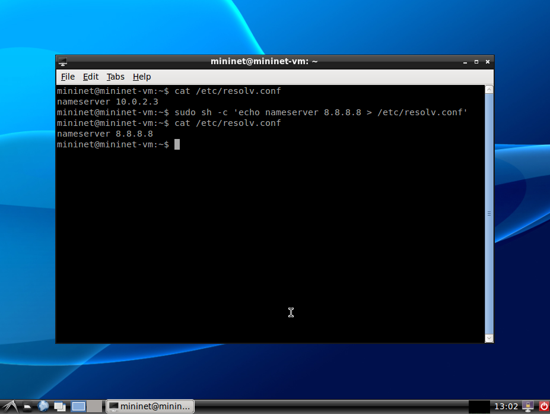
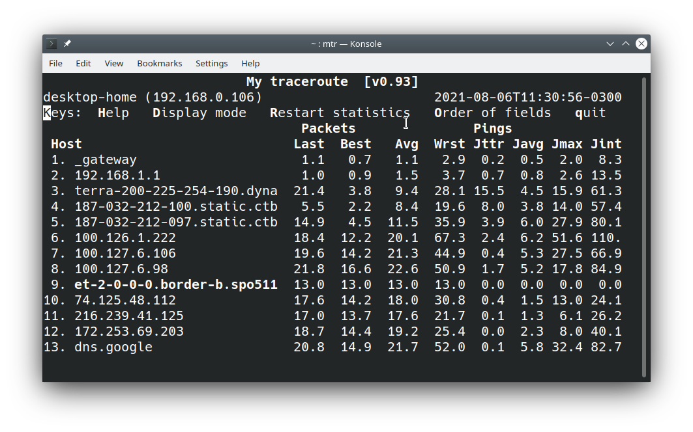

## Configuração do Ambiente Mininet para Uso em Experimentos com acesso à Internet

Duas preocupações adicionais você precisará para configurar a execução do ambiente Mininet:

* **Acesso à Internet em estação virtualizada mininet**: 

   Você precisará tomar duas precauções para que uma estação com rede virtualizada acesse a Internet e você consiga realizar o seu experimento:

   1. Neste experimento você terá que acessar um recurso na Internet em um navegador web executando uma estação com rede virtualizada pelo mininet (`h1` ou `h2`, para ficar mais evidente). No mininet, por padrão, as estações **não acessam** a Internet e para fazê-lo você precisará habilitar o NAT no mininet, o que você faz invocando o mininet com a opção `--nat`. Se você realizar corretamente essa configuração, um ping para a estação `8.8.8.8` (ou outro IP Internet) deverá funcionar.
   
   2. 🚩 A maneira como a VM do Mininet está configurada, uma estação Mininet não conseguirá utilizar o DNS e portanto não conseguirá acessar sites na Internet. Para fazê-lo, precisaremos modificar a configuração do serviço de DNS usado pelo Linux da VM mininet. 
   
            sudo sh -c 'echo nameserver 8.8.8.8 > /etc/resolv.conf'
            
   Ao executar esse comando, o arquivo `/etc/resolv.conf` deverá ficar com o conteúdo `nameserver 8.8.8.8`. Você confirma isso  com o seguinte comando:
   
        cat /etc/resolv.conf
    
   Entre então na estação `h1` do Mininet e execute o comando `nslookup www.ufg.br` que deverá aparecer o IP da estação `www.ufg.br`. Do contrário, reveja os passos anteriores. O IP `8.8.8.8` é um servidor de DNS público da Google. Esses passos estão ilustrados na figura abaixo. **IMPORTANTE**: ao reiniciar a VM, a configuração do DNS voltará à original, então você terá que repetir os passos acima.
   
   
   
* **Configuração de Jitter no Mininet**

   Para configurar um jitter em cenário virtualizado no mininet você precisará adicionar um novo parâmetro `jitter`, dado em `ms`, que corresponde à variação do atraso que também precisará ser indicado no parâmetro de configuração do cenário. Por exemplo, para simular largura de banda de 54Mbps, atraso de 50ms e jitter de 20ms, assim como habilitar o NAT mencionado no item anterior, você precisará executar o mininet da seguinte maneira:
   
        sudo mn --nat --link tc,bw=54,delay=50ms,jitter=20ms
        
## MTR

O MTR é uma ferramenta similar ao traceroute, mas com muito mais flexibilidade e poder na coleta dos dados de comunicação. Basicamente, você precisa indicar o endereço do destino como parâmetro e ele mostrará a rota estimada para o destino e diversas medições de atraso em cada roteador no caminho. Neste experimento, só nos interessará os dados coletados no destino. Utilizaremos o MTR para estimar o jitter, passando o parâmetro `-o` e os campos que queremos que sejam exibidos, como no seguinte exemplo (que você pode usar no experimento, alterando o endereço): 

        mtr -o NBAWJMXI 8.8.8.8 -n

A figura abaixo mostra o exemplo de saída do MTR para o comando indicado. No caso mecionado, solicitamos ao MTR para exibir na sequência as medições de **último**, **melhor**, **médio** e **pior** atrasos, seguido de **último**, **médio** e **pior** jitter, terminando com jitter **interchegada** de pacotes. Atrasos são sempre o RTT e em ms.

<a id="atualizacao-mtr" />

🚩 A versão do `mtr` disponível em algumas VMs do mininet causam alguns problemas na execução. Para você conseguir fazer os testes, baixe uma versão mais nova do `mtr`. Deixei uma versão para vocês instalarem usando os seguintes comandos:

        cd ~
        wget https://github.com/rcarocha-dcc-ufcat/labs-auxilio/raw/master/rc2/softwares/mtr-0.89.zip
        unzip mtr-0.89.zip

É importante não esquecer da primeira linha, pois ela copiará os arquivos para o diretório raiz do usuário mininet. Feito isso, quando for executar, faça o seguinte:

        ~/mtr -o NBAWJMXI 8.8.8.8 -n
        
Observe com atenção o uso do **`~/mtr`** (til-barra-mtr) e, sugiro, usar a opção `-n` no final. Você deverá executar como admin, mas isso não será problema dentro do mininet. Caso apareça o erros

        Failure to open IPv4 sockets: Operation not permitted
        Failure to open IPv6 sockets: Address family not supported by protocol
        /home/mininet/mtr: Failure to start mtr-packet: Invalid argument
        
Execute como admin

        sudo ~/mtr -o NBAWJMXI 8.8.8.8 -n

