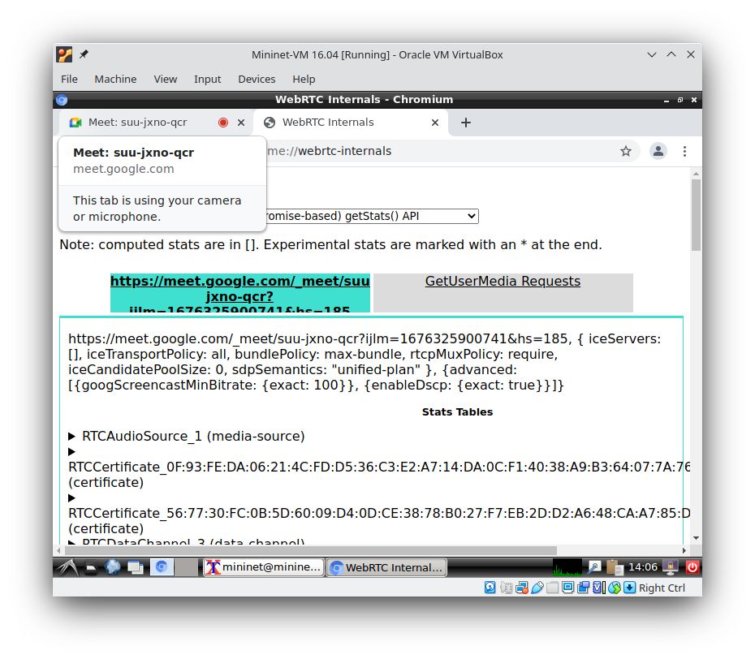
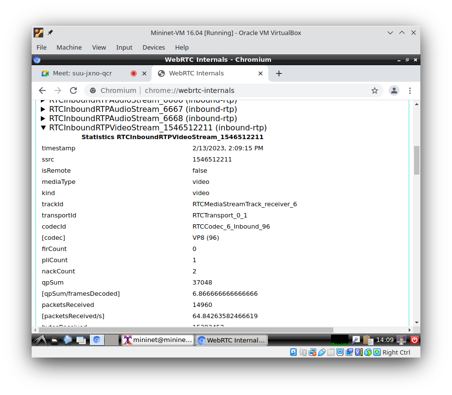
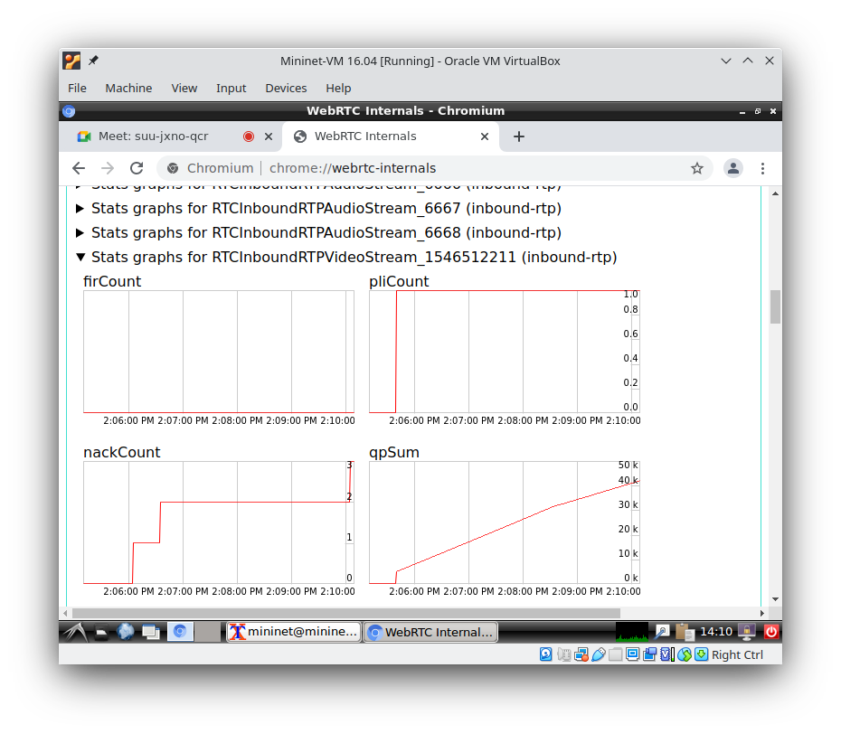
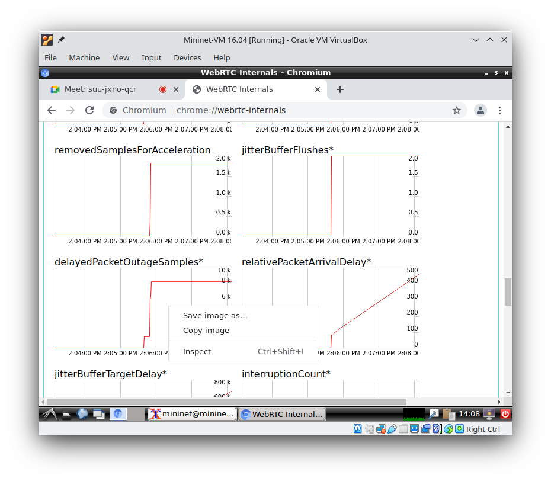

## Instalação do Chromium

Para instalar o Chrome/Chromium na estação mininet, utilize o seguinte comando:

        sudo apt install chromium-browser

O Chrome é executado com o comando `chromium-browser`.

## Acesso Detalhes do Funcionamento webRTC

No Chrome/Chromium, para abrir aba de depuração do webrtc deve-se digitar em nova aba de endereços: `chrome://webrtc-internals/`. A interface exibida pelo Chrome/Chromium é a seguinte:

Essa interface permite verificar e acompanhar o funcionamento em tempo real do protocolo, incluindo estatísticas de funcionamento. No laboratório, verificaremos apenas a stream de entrada de video (video recebido pelo Meet). Para isso, você deve identificar um campo **`RTCInboundRTPVideoStream`** seguido por um identificador do fluxo que, na figura abaixo é **`1546512211`**. Neste campo, como observado na figura, é possível obter a última informação de comunicação da respectiva stream como codec de video utilizado, número de ACKs, pacotes recebidos e taxa de recebimento de pacotes (throughtput efetivo), entre vários outros.

Você encontrará um a discussão detalhada no link <https://testrtc.com/webrtc-internals-parameters/>, caso precise de mais informações ou queira entender todos os detalhes de funcionamento.

Nós estaremos interessados nas estatísticas dessa comunicação que são, basicamente, gráficos que mostram como esses parâmetros mudaram durante a transmissão. Inicialmente, você precisará identificar o campo de deputação **"Stats Graph for RTCInboundRTPVideoStream_"** para o mesmo identificador de stream anterior (no exemplo, **`1546512211`**), conforme mostrado na figura abaixo. 

Você poderá salvar em arquivo qualquer um desses gráficos, clicando com o segundo botão do mouse, conforme mostrado na figura. 

### Documentação Adicional sobre webrtc-internals

* The Missing chrome://webrtc-internals Documentation - <https://testrtc.com/webrtc-internals-documentation/>
* How do you find the current active connection in webrtc-internals? - <https://testrtc.com/find-webrtc-active-connection/>
* What do the Parameters in webrtc-internals Really Mean? - <https://testrtc.com/webrtc-internals-parameters/>

