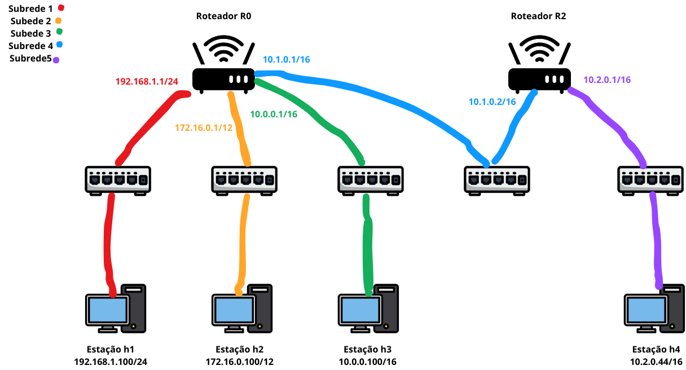

# Laboratório 4.1: Roteamento Estático no Linux

## Identificação

* Aluno: "COLOQUE O SEU NOME AQUI"

## Objetivos

+ Ampliar a compreensão das funcionalidades do mininet.
+ Entender a configuração e o funcionamento do software de roteamento do Linux.
+ Configurar e testar uma rede simples com roteamento estático (configurar as tabelas de roteamento).
+ Dar noções da programabilidade do mininet, via Python.

## Formato das respostas

Exceto quando informando explicitamente, todos os resultados devem ser formatados usando a formatação de código no Markdown, conforme já feito nos laboratórios anteriores. Respostas em texto livre devem ser escritas em **texto normal**, sem formatação.

* Documentação do formato de tabelas no Markdown Github: <https://docs.github.com/en/github/writing-on-github/working-with-advanced-formatting/organizing-information-with-tables>

**Observe** que neste laboratório você deverá incluir arquivos externos com os dados coletados no experimento, além dos gráficos gerados. 

## Requisitos mínimos de entrega deste relatório

Conforme indicado no plano da disciplina, para obter nota mínima de 6,0 do relatório será necessário que ele atenda a **todos** os requisitos abaixo indicados:

1. Todas as tarefas na seção "Resultados" devem ser respondidas e devem seguir o formato solicitado.
2. Não deve haver qualquer tipo de cópia deste relatório com o que outro aluno. Os experimentos e o relatório são individuais.
3. O seu relatório deverá ser submetido pelo Github Classroom.

A complementação da nota pela avaliação qualitativa do relatório, considerará as respostas das questões abertas (em texto livre) e **sobretudo** os resultado do experimento.

Na seção [**"Feedback"**](#Feedback) ao fim deste relatório, o professor incluirá a avaliação do seu relatório.

# Visão Geral

Neste laboratório você irá utilizar o mininet para experimentar uma rede IP simples, que usa dois roteadores para permitir a comunicação entre estações de redes diferentes. Você configurará a tabela de roteamento dos roteadores. 

# Roteamento no Linux

Uma estação Linux pode ser facilmente configurada para realizar o roteamento estático. Primeiramente, é necessário configurar as propriedade do sistema operacional que controlam o funcionamento do roteamento. 

Todas as propriedades de rede do Linux podem ser vistas e controladas pelo programa `sysctl`. Para visualizar as propriedade, utilize o comando:

        sysctl -a

Em particular, estamos interessados na propriedade `net.ipv4.ip_forward`, que controla se a estação poderá encaminhar pacotes IP de uma interface para outra (*forwarding*) ou não (configurando uma estação normal). Em ambos os casos, o Linux utilizará a tabela de roteamento para decidir o que fazer com os pacotes. O valor da propriedade pode ser 0 ou 1, e 1 permite o funcionamento como roteador:

        sysctl net.ipv4.ip_forward

A mudança da propriedade é realizada com o comando:

        sysctl net.ipv4.ip_forward=1

A tabela de roteamento da estação pode ser obtida com o comando `route` (com ou sem a opção `-n`).

        route
        route -n

A tabela abaixo mostra um exemplo de saída do programa

        Destination     Gateway         Genmask         Flags Metric Ref    Use Iface
        192.168.1.0     0.0.0.0         255.255.255.0   U     0      0        0 eth0
        0.0.0.0         192.168.1.10    0.0.0.0         UG    0      0        0 eth0

Para adicionar uma rota *default* à tabela, utiliza-se a opção `add` ao comando `route`, junto com os respectivos parâmetros. Por exemplo: 

        route add default gw 192.168.1.10

Para adicionar uma rota específica, deve-se acrescentar os parâmetros `-net`, `netmask` e `gw` (gateway, que significa roteador ou rota)

        route add -net 192.168.3.0 netmask 255.255.255.0 gw 192.168.3.10

Para remover uma rota, utiliza-se a opção `del`, com a indicação completa da rota a remover

        route del -net 192.168.3.0 netmask 255.255.255.0 gw 192.168.3.10

## Topologias específicas no mininet

No laboratório introdutório, utilizamos ou a topologia default do mininet ou o parâmetro `--topo` para configurar topologias de referência existentes no mininet. Por exemplo: 

        sudo mn --topo single,3
        sudo mn --topo linear,4

Na maioria das vezes, essas topologias não representam adequadamente o cenário que precisamos experimentar e por isso precisamos escrever um código de configuração indicando exatamente as características da topologia desejada. Toda configuração e programação do mininet é realizada por código Python.

Um exemplo de topologia personalizada está disponível no arquivo `~/mininet/custom/topo-2sw-2host.py` (olhar na sua VM mininet). Para visualizar arquivos você pode usar os comandos:

        less ~/mininet/custom/topo-2sw-2host.py

ou usar o editor de textos `pico`.

        pico ~/mininet/custom/topo-2sw-2host.py

Para usar essa topologia no mininet, inicie o mininet, com o parâmetro `--custom`, conforme abaixo:

        sudo mn --custom ~/mininet/custom/topo-2sw-2host.py --topo mytopo

## Exemplos de topologias e funcionalidades personalizadas

Além de topologias, utilizando programas Python é possível adicionar ou modificar funcionalidades de rede no mininet e automatizar algumas tarefas necessárias ao seu experimento. Exemplo de códigos que fazem isso estão disponíveis no diretório **`~/mininet/examples`**.

## Um roteador Linux no mininet

Um dos exemplos, mostra a implementação da funcionalidade de um roteador Linux. O exemplo está no arquivo [~/mininet/examples/linuxrouter.py](https://github.com/mininet/mininet/blob/master/examples/linuxrouter.py). Na verdade, o exemplo apenas configura uma estação para realizar o roteamento corretamente. 

Para executar o código, utilize o comando (**IMPORTANTE**: utilizar python2!)

        sudo python2 ~/mininet/examples/linuxrouter.py

**Observe** que o próprio código já inicia o mininet.

### Tarefas 

1. Verifique as tabelas de roteamento do roteador `r0` e de cada um dos hosts.
2. Teste a conectividade entre os hosts (usando `ping` ou `pingpair`)

## Topologia com dois roteadores

Neste laboratório, utilizaremos uma topologia com dois roteadores descrita no arquivo [`codigo/linuxrouter-adaptado.py`](codigo/linuxrouter-adaptado.py).

# Atividades 

1. Execute a rede descrita pelo código **`linuxrouter-adaptado.py`**. Descreva as redes e estações participantes do experimento, de acordo com o seguinte exemplo (uma linha para cada rede e os IPs das estações separador por vírgulas):

| Rede   | Máscara     | IPs                          |
|--------|-------------|------------------------------|
| rede 1 | 192.168.1.0/24 | 192.168.1.1/24 192.168.1.100/24 |
| rede 2 | 172.16.0.0/12 | 172.16.0.1/12, 172.16.0.100/12 |
| rede 3 | 10.0.0.0/16 | 10.0.0.1/16 10.0.0.100/16 | 
| rede 4 | 10.1.0.0/16 | 10.1.0.1/16 10.1.0.2/16 | 
| rede 5 | 10.2.0.0/16 | 10.2.0.1/16 10.2.0.44/16 |

2. Faça um diagrama mostrando a interconexão entre os dispositivos do cenário e os endereços IP de cada um deles, incluindo roteadores, conforme o exemplo abaixo. Apenas substitua a figura [diagrama/cenario.png](diagrama/cenario.png) pela figura que você criar (fique livre para fazer o diagrama como quiser, mesmo que seja a mão).

3. Verifique as tabelas de roteamento das estações e roteadores, particularmente **`r0`**, **`r2`** e a estação **`h4`**. Reproduza as tabelas de roteamento, indicando a saída do comando `route` para **cada** estação devidamente identificada, conforme exemplo abaixo.

   * Tabela de Roteamento de **r0**:
   
   | Destino     | Máscara       | Roteador     |
   |-------------|---------------|--------------|
   | 10.0.0.0 | 255.255.0.0 | 0.0.0.0 |
   | 10.1.0.0     | 255.255.0.0  | 0.0.0.0 |
   | 172.16.0.0 | 255.240.0.0 | 0.0.0.0    |
   | 192.168.1.0 | 255.255.255.0  | 0.0.0.0 |

 * Tabela de Roteamento de **r2**:
   
   | Destino     | Máscara       | Roteador     |
   |-------------|---------------|--------------|
   | 10.1.0.0 | 255.255.0.0 | 0.0.0.0 |
   | 10.2.0.0     | 255.255.0.0  | 0.0.0.0 |
   
* Tabela de Roteamento de **h1**:
   
   | Destino     | Máscara       | Roteador     |
   |-------------|---------------|--------------|
   | 0.0.0.0 | 0.0.0.0| 192.168.1.1 |
   |192.168.1.0 | 255.255.255.0  | 0.0.0.0 |

  * Tabela de Roteamento de **h2**:
   
   | Destino     | Máscara       | Roteador     |
   |-------------|---------------|--------------|
   | 0.0.0.0 | 0.0.0.0| 172.16.0.1 |
   |172.16.0.0 | 255.240.0.0  | 0.0.0.0 |

   * Tabela de Roteamento de **h3**:
   
   | Destino     | Máscara       | Roteador     |
   |-------------|---------------|--------------|
   | 0.0.0.0 | 0.0.0.0| 10.0.0.1|
   |10.0.0.0 | 255.255.0.0  | 0.0.0.0 |

  * Tabela de Roteamento de **h4**:
   
   | Destino     | Máscara       | Roteador     |
   |-------------|---------------|--------------|
   | 0.0.0.0 | 0.0.0.0| 10.2.0.1|
   |10.2.0.0 | 255.255.0.0  | 0.0.0.0 |

5. Teste a conectividade entre as estações (particularmente entre **`h4`** e as demais estações). Indique os comandos utilizados para testar a conectividade e as saídas geradas pela execução. 

	   ***
	   mininet> pingall
	   Ping: testing ping reachability
			h1 -> h2 h3 X r0 X 
			h2 -> h1 h3 X r0 X 
			h3 -> h1 h2 X r0 X 
			h4 -> X X X X r2 
			r0 -> h1 h2 h3 X r2 
			r2 -> X X X h4 X 
			*** Results: 50% dropped (15/30 received)

6. Explique os problemas de conectividade obtidos, em função da estrutura da rede e das tabelas de roteamento.

   h1, h2 e h3 conseguem conversar entre si através do roteador r0, porem não alcançam a estação h4 e nem o roteador r2. h4 só consegue enviar mensagens a r2 e r2 só consegue enviar mensagens a h4. Logo imagina-se que o problema seja na interação de r0 com r2 e vice-versa, ao analizar as tabelas de roteamentos dos dois percebemos que:

   A tabela de roteamento de r0 não possui uma rota específica para a sub-rede 10.2.0.0/16, que é a sub-rede à qual h4 pertence. Como resultado, r0 não sabe para onde enviar os pacotes destinados a h4.
   A tabela de roteamento de r2 não possui rota especifica para as subredes (ou uma rota defaut) h1, h2 e h3, que são 192.168.1.0/24, 172.16.0.0/12 e 10.0.0.0/16, respectivamente.
   
8. Conserte as tabelas de roteamento das estações, de maneira que a conectividade seja restabelecida. 
9. Indique o(s) comando(s) utilizados para ajustar a tabela de roteamento, reproduzindo **apenas** os comandos utilizados, um por linha.

        Em r0: route add default gw 10.1.0.2
        Em r2: route add default gw 10.1.0.1

10. Reproduza as tabelas de roteamento corretas, a exemplo do que foi feito no item **2**. Não se esqueça de indicar **todos** os roteadores do cenário.

     * Tabela de Roteamento de **r0**:
   
   | Destino     | Máscara       | Roteador     |
   |-------------|---------------|--------------|
   | 10.0.0.0 | 255.255.0.0 | 0.0.0.0 |
   | 10.1.0.0     | 255.255.0.0  | 0.0.0.0 |
   | 172.16.0.0 | 255.240.0.0 | 0.0.0.0    |
   | 192.168.1.0 | 255.255.255.0  | 0.0.0.0 |
   | 10.1.0.2 | 0.0.0.0  | 0.0.0.0 |

 * Tabela de Roteamento de **r2**:
   
   | Destino     | Máscara       | Roteador     |
   |-------------|---------------|--------------|
   | 10.1.0.0 | 255.255.0.0 | 0.0.0.0 |
   | 10.2.0.0     | 255.255.0.0  | 0.0.0.0 |
   | 10.1.0.1 | 0.0.0.0  | 0.0.0.0 |
   
* Tabela de Roteamento de **h1**:
   
   | Destino     | Máscara       | Roteador     |
   |-------------|---------------|--------------|
   | 0.0.0.0 | 0.0.0.0| 192.168.1.1 |
   |192.168.1.0 | 255.255.255.0  | 0.0.0.0 |

  * Tabela de Roteamento de **h2**:
   
   | Destino     | Máscara       | Roteador     |
   |-------------|---------------|--------------|
   | 0.0.0.0 | 0.0.0.0| 172.16.0.1 |
   |172.16.0.0 | 255.240.0.0  | 0.0.0.0 |

   * Tabela de Roteamento de **h3**:
   
   | Destino     | Máscara       | Roteador     |
   |-------------|---------------|--------------|
   | 0.0.0.0 | 0.0.0.0| 10.0.0.1|
   |10.0.0.0 | 255.255.0.0  | 0.0.0.0 |

  * Tabela de Roteamento de **h4**:
   
   | Destino     | Máscara       | Roteador     |
   |-------------|---------------|--------------|
   | 0.0.0.0 | 0.0.0.0| 10.2.0.1|
   |10.2.0.0 | 255.255.0.0  | 0.0.0.0 |

## Feedback do Professor

*Esta seção será escrita pelo professor ao final da avaliação do seu relatório*.

