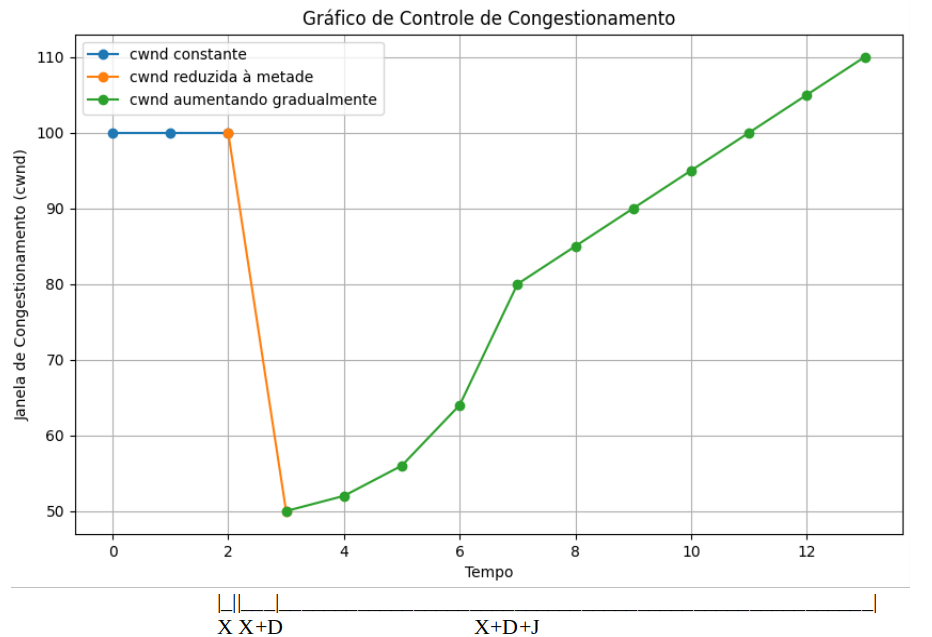

## 1a Questão

Considere uma conexão TCP na qual está sendo feito o download de um arquivo grande e que cuja comunicação fim-a-fim encontra-se a algum tempo sem mudança (melhoria ou piora) no congestionamento até um certo instante `X`. Considere a ocorrência da seguintes situações:
       
  1. No instante `X+D`, um congestionamento causou a diminuição da vazão à metade.
  2. No instante `X+D+J`, o congestionamento termina, e a vazão da conexão fica 10% melhor que a vazão percebida no instante `X`.

Desenhe e EXPLIQUE o comportamento do gráfico de controle de congestionamento que seja representativo dessa conexão nos instante de `X` até a estabilidade após `X+D+J`. 

* **Atenção**
  * Fique livre para desenhar o esboço do gráfico na ferramenta que quiser (ou mesmo tirando foto de um desenho), mas a sua resposta deve ficar no arquivo `figuras/1-grafico.png` (no Github) e deve aparecer acima.
  * A sua resposta deve **necessariamente** ser escrita em markdown e estar disposta na seção abaixo.

### Resposta (Q.1)
<!---- RESPOSTA ----->

 

Temos a vazão da rede estável em 100bts até o instante X temos um congestionamento na rede devido a ocorrência de Timeout. Por conta do congestionamento durante o momento X+D, temos a diminuição da janela de congestionamento na comunicação TCP, buscando parar a ocorrencia de Timeouts.
No momento X+D+J nós temos o aumento exponencial da janela, pois o TCP iniciou o processo de slow start para buscar até qual ponto é possivel aumentar a janela sem a ocorrencia de Timouts. Ao chegar no limitante (por volta de 80 no gráfico) a janela começa a aumentar de forma linear (5 em 5), para estabelecer de forma precisa qual deve ser a nova janela, até chegar em 110bts ( 10% a mais de vazão que a inicial).
<!------------------->

