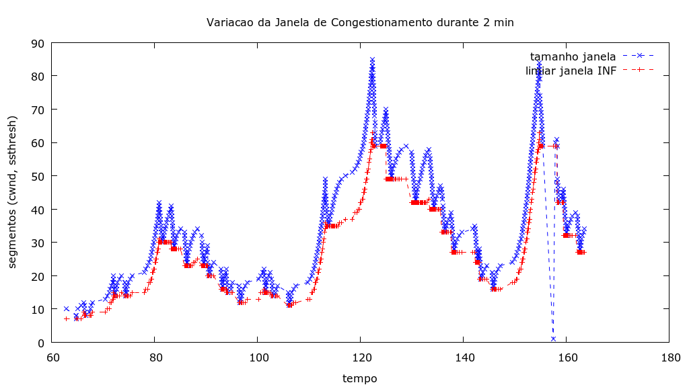

 
## 4a Questão

Considere duas transmissões T1 e T2 entre quatro processos:

* T1: é uma transmissão TCP entre dois processos que estão em estações distantes (por exemplo, em continentes diferentes)
* T2: é uma transmissão TCP entre dois processos que estão próximos. 

A janela de congestionamento das duas transmissões TCP é muito parecida e igual à indicada na figura abaixo. Considere para efeito da resposta que elas são iguais.

O que podemos afirmar sobre a velocidade (throughput) da conexão T1 em relação a T2? Justifique.

### Resposta (Q.4)
<!---- RESPOSTA ----->

A velocidade (throughput) da conexão T1 provavelmente será inferior à velocidade da conexão T2. Isso ocorre porque a janela de congestionamento, representada pela "cwnd" na figura, indica a quantidade de dados que pode ser transmitida antes de receber uma confirmação. No caso da transmissão T1, que ocorre entre processos em estações distantes, ela enfrenta um atraso de propagação significativo devido à maior distância física. Esse atraso de propagação contribui para um maior Round-Trip Time (RTT) na conexão T1 em comparação com a conexão T2, que ocorre entre processos próximos.. O RTT maior na conexão T1 resultará em um throughput inferior, mesmo que a janela de congestionamento seja semelhante. Portanto, podemos afirmar que a conexão provavelmente T1 terá uma velocidade de transmissão inferior à conexão T2, devido ao maior tempo de ida e volta entre as estações remotas.

<!------------------->

