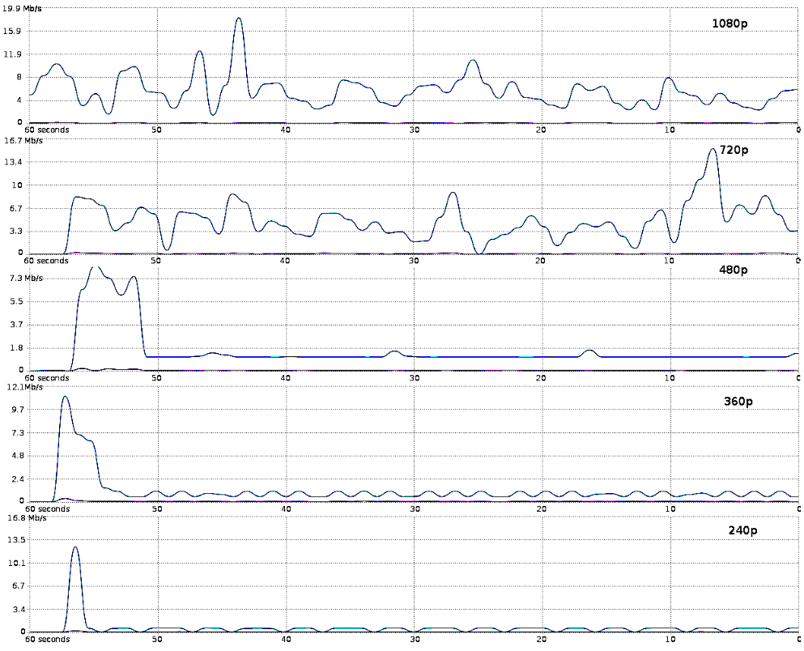
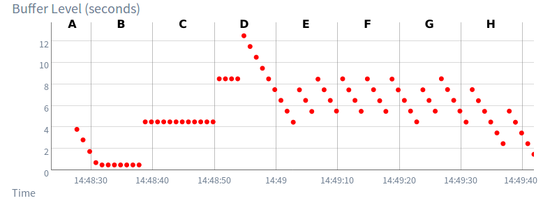
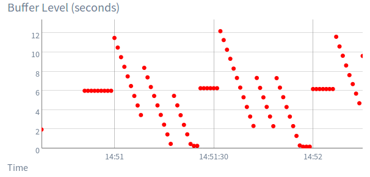

# Prova 2 de Redes de Computadores 2

## Dados da Prova

* **ALUNO**: <!-- COLOQUE O SEU NOME AQUI -->
* **REGRAS**
   * Prazo de entrega da prova: Sexta, 1/março.
   * A prova deverá ser respondida no Github Classroom. Responda como se estivesse fazendo um laboratório. 
   * Ao final da prova, dê o commit no git, e NÃO ESQUEÇA de executar o push no repositório. Se você acessar a sua prova pela interface web do Github e ela estiver atualizada lá, então é sinal de que o push foi realizado corretamente.
   * Todas as suas respostas devem estar NESTE arquivo.
   * Esta prova será publicada no Google Classroom.
   * Dúvidas sobre a prova deverão ser postadas como comentário na tarefa Google Classroom.
   * BOA PROVA!

### Tipos de Aplicações de Streaming

**Questão 1:** Considere os gráficos abaixo mostrando a taxa de download de conteúdo multimídia para conteúdo com 5 (cinco) qualidades diferentes (o primeiro para resolução de 1080x1920) para uma certa aplicação hipotética de multimídia em rede.

   a. Dentre as classes de aplicações de streaming de multimídia pela rede, qual(is) poderiam ser descritas pelos gráficos. JUSTIFIQUE.
    
 Os gráficos são de streaming de multimídia armazenada, pois há um pico de download no início dos gráfico  ,referente as qualidades 240p,360p,480p, devido a caracteristica do download de mídia armazenada que faz um download incial grande para abastecer o buffer. E posteriormente temos uma constancia, devido ao armazenamento de buffer.
 Levando em consideração que que a banda é a mesma em todas as qualidades, na qualidade 720p, 1080p, o gráfico varia bastante devido ao problema do download não ser o sufciente para fazer o download para o buffer, então devido a alteração dinamica é reduzido a taxa de download quando a banda é completamente utilizada então o video trava, e depois a taxa de download é aumentada pois a banda está disponível.
 Levando por um lado que o gráfico não é da mesma aplicação, os graficos de 720p e 1080p tambem poderiam se referir a um grafico de streaming ao vivo, ja que é comum nesse tipo de transmissão a variação de frames a serem baixados.

   b. Caso se aplique, qual é o estado da bufferização, antes de 50s e depois de 50s para cada classe de aplicação mencionada.
    Para as qualidades 240p,360p,480p antes dos 50 o buffer está vazio e então temos um pico de download e preenche o buffer, depois dos 50 o buffer vai aumentando de tamanho e permance estável de forma a estar quase cheio e a banda estável.
    Para as qualdiades 720p e 1080 antes dos 50 o buffer está vazio e então temos um pico de download e preenche o buffer, depois dos 50 o buffer se esvazia devido a baixa quantidade de download e depois se enche quando a banda fica disponivel, e não consegue aumentar de tamanho constantemente igual nas qualdiades inferiores.

   

### Efeito do Atraso, Jitter e Largura de Banda em Aplicações de Streaming

**Questão 2:** O gráfico abaixo mostra a variação do buffer de um cliente de streaming durante a execução de um video armazenado. Explique o significado da porção B do gráfico, em termos do funcionamento do cliente de streaming e da percepção do usuário.

Na porção B nós temos um buffer constante após o periodo incial que começou grande e reduziu para 1s de forma constante, onde a taxa de download do vídeo é igual a taxa de reprodução sem zerar o buffer,  temos no final um aumento de buffer para 4s devido a constancia do tamanho do buffeer permitir aumenta-lo. O usuário então vai ter uma experiencia de assistir sem interrupções para carregar.

**Questão 3:** Explique o significado da porção C e início de D do gráfico, em termos do funcionamento do cliente de streaming e da percepção do usuário.

Na C temos a continuidade de um buffer de 4s, para o cliente de streaming ele continua enviando a mesma quantidade de pacotes durante todo o tempo de C, porem como o buffer não se mantem constante em D temos o crescimento do tamannoo do buffer para 8 segundos.

**Questão 4:** Em quais porções do gráfico, o cliente foi capaz de fazer acessos com sucesso à rede por quadros do video?

Nas porções de A a D, pois nesses momentos o vídeo ocorreu de forma à taxa de download do vídeo ser igual à taxa de reprodução sem diminuir o tamanho do buffer. Da metade de D para a frente, temos um uso superior ao da banda, fazendo o tamanho do buffer diminuir. De E para frente, temos a variação do tamanho do buffer, de modo que ele cresce e diminui, mostrando que há algum problema em acessar com sucesso à rede por quadros do vídeo.

**Questão 5:** Quais porções do gráfico seriam candidatas ao cliente modificar o bitrate do video selecionado, por exemplo, de 1Mbps para 500kbps? Justifique.

   Nas porções de D para H, pois ao ocorrerem problemas de buffering frequentes devido a flutuações na largura de banda ou em condições de rede, a adaptação dinâmica do bitrate pode ajudar a manter um buffer "saudável", evitando interrupções na reprodução. Ao fazer isso nós impediriamos a variação de buffer.

**Questão 6:** Que explicação você daria para o buffer acima de 12s em D e depois o subsequentes buffers variando de 4 a 8s aproximadamente?

Na porção D do gráfico, observamos que o buffer atinge um pico máximo e, em seguida, cai o tamanho da janela. Esse comportamento indica que o cliente de streaming acumulou uma quantidade excessiva de dados em buffer que a banda disponivel não conseguia suportar.  Ao analisar os buffers subsequentes, que variam entre 4 e 8 segundos, percebemos uma dinâmica de ajuste contínuo por parte do cliente. Essa variação sugere que o cliente está adaptando dinamicamente o tamanho do buffer com base nas condições da rede. Possívelmente causado por fatores desencadeadores, que incluem mudanças na velocidade de download, flutuações na conexão ou alterações na qualidade do vídeo. Ao ajustar dinamicamente o tamanho do buffer, o cliente evita tanto o buffering excessivo, que poderia resultar em longos períodos de espera, quanto a reprodução contínua sem buffer, que levaria a interrupções na reprodução.
   

**Questão 7:** O gráfico abaixo mostra um cenário de streaming de video ao vivo. Qual é o atraso máximo presumível entre o video ao vivo e a exibição no cliente de streaming?

   Durante o intervalo de 14:51 a 14:51:30, o nível de buffer mantém-se estável em aproximadamente 6 segundos antes de começar a flutuar. Entre 14:51:30 e 14:52, observamos variações significativas nos níveis de buffer, atingindo um pico de aproximadamente 12 segundos. Usando a formula: Atraso Maximo = Tempo atual - Momento de pico do Buffer. Descobrimos que o atraso maximo é de 12 segundos.

**Questão 8:** O visualização ao vivo no cliente de streaming continua sendo mantida em todo o período mostrado no gráfico? Explique.

   
A visualização ao vivo no cliente de streaming não é mantida durante todo o período apresentado no gráfico. Ao analisar o nível do buffer em segundos ao longo do tempo, observa-se que em alguns momentos, o buffer cai para 2 segundos ou menos, indicando possíveis interrupções ou impactos na visualização ao vivo. O gráfico exibe flutuações nos níveis do buffer, atingindo um pico de aproximadamente 12 segundos. Essa variação sugere que a experiência de visualização ao vivo pode ter sido afetada, com períodos de buffer mais alto, mas também momentos em que o buffer estava mais baixo. Essas flutuações indicam possíveis atrasos ou pausas durante o período analisado.

### LEMBRETE

Ao final da prova, dê o commit no git, **e NÃO ESQUEÇA de executar o push no repositório**. Se você acessar a sua prova pela interface web do Github e ela estiver atualizada lá, então é sinal de que o push foi realizado corretamente.

* 'LUAN DINIZ MAZARO RODOVALHO' ===> 5,5 (lab Prova P2)

* **Revisões/Problemas**:
  * Ver respostas em <https://drive.google.com/file/d/18mQcGfW5VRKu1-kVHsKVy9hKws0gvRV-/view?usp=sharing>
  * Correção:
    * **Q1.A**: (1.5/1.5)  ok
    * **Q1.B**: (1.5/1.5)  ok
    * **Q2**: (0/1.0)   esse comportamento é muito difícil, pois você está considerando que a chegada de quadros e colocação no buffer ocorre **simultaneamente** ao consumo. seria necessário uma coincidência grande e estaria ocorrendo várias vezes durante a transmissão.
    * **Q3**: (0/1.0)   "cliente enviando pacotes"? sua resposta está estranha. o cliente recebe os pacotes (de um servidor) e reproduz quadros. 
    * **Q4**: (0/1.0)   não comprendeu os gráficos e o significado dos eixos.
    * **Q5**: (0/1.0)   não comprendeu os gráficos e o significado dos eixos.
    * **Q6**: (1.0/1.0)   ok
    * **Q7**: (1.0/1.0)   ok
    * **Q8**: (0.5/1.0)   não é simplesmente nessa condição que o video não é reproduzido.
